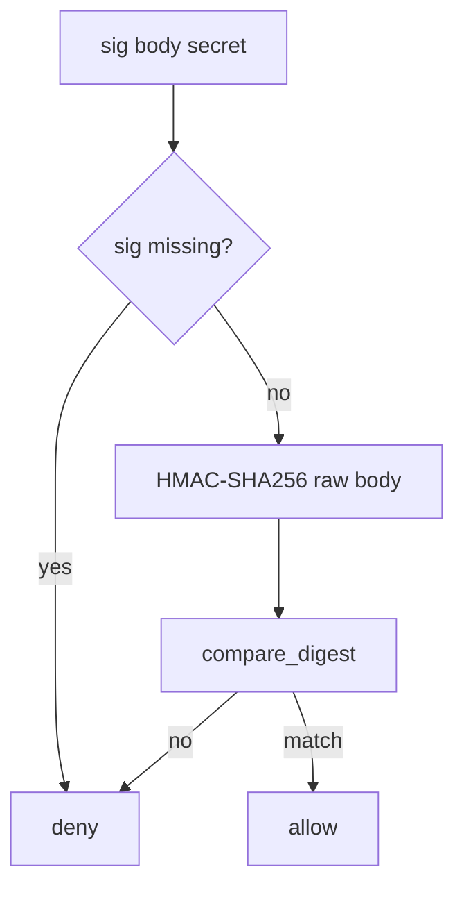

# HMAC-SHA256 compare_digest over the raw body

**Kind:** design-exercise
**Loop step:** 4 Build

## The rule

TLS is not the fix. An IP allow-list is not the fix. Hashing parsed JSON is not the fix. JWT login of the end user is not the fix.

Structural means the MAC is checked before side effects. `accept` must compute HMAC-SHA256 over the raw body with the disposable secret and compare in constant time. Missing or wrong signatures deny.

The smallest restore for the notes-app billing webhook is: empty sig denies. Fail closed: empty signature **denies** without throwing into a 500 that providers retry (6.7). Do not fail open because the secret store was unreachable.

## Picture: fail closed on a missing sig



The lab’s repaired files hash the raw body string with stdlib HMAC-SHA256 and `compare_digest`. Production still needs the MAC **before** `json.loads` (2.1): parse-then-re-serialize is a different document than the provider signed. Replay of a valid MAC and stale timestamps are named leftovers, not this check. Outbound webhook URLs are 6.5, not this inbound MAC.

Use that standard-library check. This week's check is about empty sig. **Do not POST a live provider.**

## What the repaired files must show

Open `fixed/hook.py`. Do not treat the snippet as a production Stripe integration.

| After the fix | Must be true |
|---|---|
| empty sig | false |
| wrong sig | false |
| matching MAC over same body | true |

Fail closed: if the signature is missing or wrong, the answer is no. Uncertainty is a **deny**, not a yes because TLS looked fine.

## What this is not

TLS as authenticity. IP allow-list. MAC over `json.dumps(json.loads(body))`. JWT of the end user. “We called the vendor’s verify” without testing a missing sig. Secret in a query string (4.3).

## What the tool cannot do

- A correct signature still needs 1.2 on side effects (what the handler writes).
- Replay of a valid MAC and stale timestamps remain leftover.
- Outbound webhook URLs are 6.5 (the server calling out), not this inbound MAC.
- If the provider is compromised, keep least privilege on what a webhook may do.
- Per-message signatures beyond HMAC are advanced work.

## Practice

Name the check (empty sig denies; HMAC-SHA256 over the raw body; `compare_digest`). Run:

```text
python3 -m pytest labs/7.3/7.3-lab/tests --impl fixed
```

## Use it somewhere new

A clinic example: stop treating “the hospital’s IP range” as the lab-result authenticity check.

## What can still go wrong

Replay; freshness; parse-before-MAC (2.1); 1.2 on writes; 6.5 egress; per-message signatures beyond HMAC (advanced); secret-in-query (4.3).

## What this page is not doing

Do not POST a live provider. Do not claim a course gate from a TLS screenshot.
