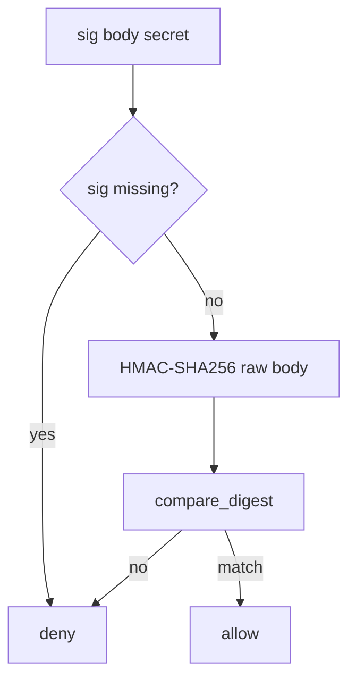

# 7.3-LO-04 — HMAC-SHA256 compare_digest over the raw body

**Kind:** design-exercise
**Loop step:** 4 Build
**Standards:** OWASP ASVS 5.0.0 (final) `v5.0.0-11.2.1`.

## Structural means the MAC is checked before side effects

`accept` must compute HMAC-SHA256 over the raw body with the disposable secret and compare in constant time. Missing or wrong signatures deny. Structural means that check — not TLS, not an IP list, not a vendor logo.

## Mental model: fail closed on missing sig



Fail-safe: empty signature denies without throwing into a 500 that providers retry.

## Why this restores the cell

| After the fix | Must be true |
|---|---|
| empty sig | false |
| wrong sig | false |
| matching MAC over same body | true |

## What this is not

TLS as authenticity. IP allow-list. MAC over `json.dumps(json.loads(body))`. JWT of the end user. “We called Stripe.verify” without testing missing sig.

## Practice

Name the predicate. Run:

```
python3 -m pytest labs/7.3/7.3-lab/tests --impl fixed
```

Must pass.

## Transfer

Clinic: stop treating “the hospital’s IP range” as the lab-result authenticity check.

## Residual risk

Replay; freshness; parse-before-MAC (2.1); 1.2; 6.5; `v5.0.0-4.1.5` Level 3.
