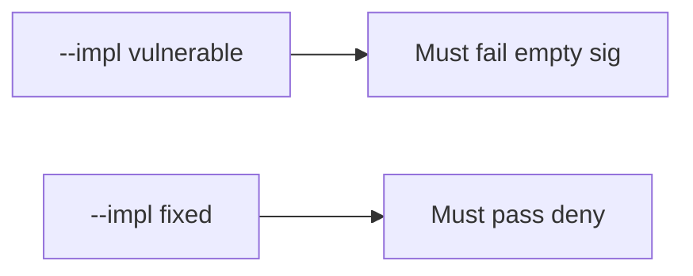

# 7.3-LO-05 — Evidence is missing sig denied, then a passing pair

**Kind:** verification-lab
**Loop step:** 5 Verify
**Standards:** OWASP ASVS 5.0.0 (final) `v5.0.0-11.2.1`.

## An invariant that cannot fail a test is still a slogan

“Webhooks are signed” is not evidence. “TLS is on” is a mechanism observation. The oracle is: `accept("", "body", "lab-secret")` is false and a matching HMAC over the same raw body is true. The empty-sig observation must be **false** on `--impl vulnerable` (returns true) and **true** on `--impl fixed`. Do not hit live providers.

## Mental model: vulnerable must fail: empty sig

The failing observation on `--impl vulnerable` is **empty sig**. A passing collection count is not this cell.



| Mode | Must show for this module |
|---|---|
| Negative / abuse | empty sig false; wrong sig false; vulnerable must fail empty |
| Normal | matching HMAC over the same raw body true (may pass on both) |
| Not claimed | replay window; parse-before-MAC; 1.2; live Stripe |

Lab tests in `labs/7.3/7.3-lab/tests/test_property.py`. `test_missing_signature_is_rejected` is a **forbidden-outcome** test: an always-true `accept` is not allowed to count as a passing control.

```text
python3 -m pytest labs/7.3/7.3-lab/tests --impl vulnerable
python3 -m pytest labs/7.3/7.3-lab/tests --impl fixed
```

Honest matching signatures may pass on both implementations. That does not excuse the missing-sig deny test. If vulnerable does not fail `test_missing_signature_is_rejected`, the lab is miswired—fix the wiring, not the assertion.

## What the tests do not prove

- Replay (`v5.0.0-2.3.4`) and freshness (`v5.0.0-2.3.3`)
- Per-message signatures (`v5.0.0-4.1.5`, Level 3 advanced)
- That production hashes the raw body rather than parsed JSON (2.1)
- Outbound URL ownership (6.5)
- That a valid MAC still respects 1.2 on side effects

Record those as residuals or later modules, not as silent passes.

## Practice

Execute both implementations this session from the lab directory if needed. Write the fail/pass pair next to the matrix row. Reject a “test” that only greps `hmac` in source without calling `accept("", "body", "lab-secret")`.

## Transfer

Clinic: a test that only asserts HTTP 200 on `/webhook` is not this cell. A live vendor POST is out of scope.

## Non-goals

Do not add a live Stripe trophy. Do not log bodies or `lab-secret`. Keys stay out of this file.
