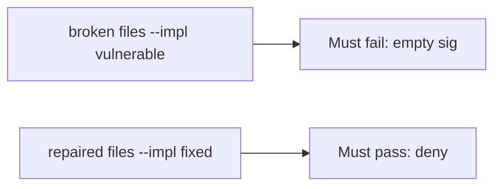

# Missing sig vs matching sig vs wrong sig

**Kind:** verification-lab
**Loop step:** 5 Verify

## Check it

“Webhooks are signed” is not evidence. “TLS is on” is a tool observation. The check is: `accept("", "body", "lab-secret")` is false and a matching HMAC over the same raw body is true. The empty-sig observation must be **false** on the broken files (returns true) and **true** on the repaired files. Tests stay local. Do not hit live providers.

## Picture: empty sig on the broken files must fail the check

A passing-test tally can still hide that an unsigned body is still accepted.



If both pass, you are not looking at a missing sig.

## What the check has to show

| Mode | Must show for this topic |
|---|---|
| Normal | Matching HMAC over the same raw body true (may pass on both) |
| Wrong input / abuse | Empty sig false; wrong sig false; broken must fail empty |
| Failure | If you cannot name the signature, do not accept |
| Not claimed | Replay window; parse-before-MAC; 1.2; live Stripe |

The test `test_missing_signature_is_rejected` is there so an always-true `accept` still fails.

Searching for `hmac` in source without calling `accept("", "body", "lab-secret")` is not evidence. This practice never POSTs a live webhook.

```text
python3 -m pytest labs/7.3/7.3-lab/tests --impl vulnerable
python3 -m pytest labs/7.3/7.3-lab/tests --impl fixed
```

Honest matching signatures may pass on both implementations. That does not excuse the missing-sig deny test. If the broken files do not fail `test_missing_signature_is_rejected`, the lab is miswired — fix the wiring, not the assertion. A setup error is not proof the rule holds.

## What the tests do not prove

- Replay and freshness
- Per-message signatures beyond HMAC (advanced)
- That production hashes the raw body rather than parsed JSON (2.1)
- Outbound URL ownership (6.5)
- That a valid MAC still respects 1.2 on side effects

## Practice

Do not treat a grep for `hmac` in source as the check. Call `accept("", "body", "lab-secret")`.

## Use it somewhere new

Asserting HTTP 200 on `/webhook` is not this check. Do not send a live vendor POST.

## What this page is not doing

Do not treat a live Stripe screenshot as proof. Do not log bodies or `lab-secret`. Answer keys are not on this site.
