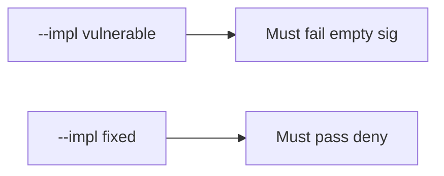

# 7.3-LO-05 — Evidence is missing sig denied, then a passing pair

**Kind:** verification-lab
**Loop step:** 5 Verify
**Standards:** OWASP ASVS 5.0.0 (final) `v5.0.0-11.2.1`.

## An invariant that cannot fail a test is still a slogan

“Webhooks are signed” is not evidence. The oracle is the local pair. Do not hit live providers.

## Mental model: vulnerable must fail: empty sig

The failing observation on `--impl vulnerable` is **empty sig**. A passing collection count is not this cell.



| Case | Must show |
|---|---|
| Negative / abuse | empty sig false; wrong sig false |
| Normal | matching HMAC over the same raw body true |
| Not claimed | replay window; parse-before-MAC; 1.2; live Stripe |

```
python3 -m pytest labs/7.3/7.3-lab/tests --impl vulnerable
python3 -m pytest labs/7.3/7.3-lab/tests --impl fixed
```

Honest matching signatures may pass on both.

## What the tests do not prove

- Replay (`v5.0.0-2.3.4`) and freshness (`v5.0.0-2.3.3`)
- Per-message signatures (`v5.0.0-4.1.5`, Level 3)
- That production hashes the raw body rather than parsed JSON
- Outbound URL ownership (6.5)

## Practice

Execute both implementations. Map each test to an LO-02 cell.

## Transfer

Clinic: a test that only asserts HTTP 200 on `/webhook` is not this cell.
