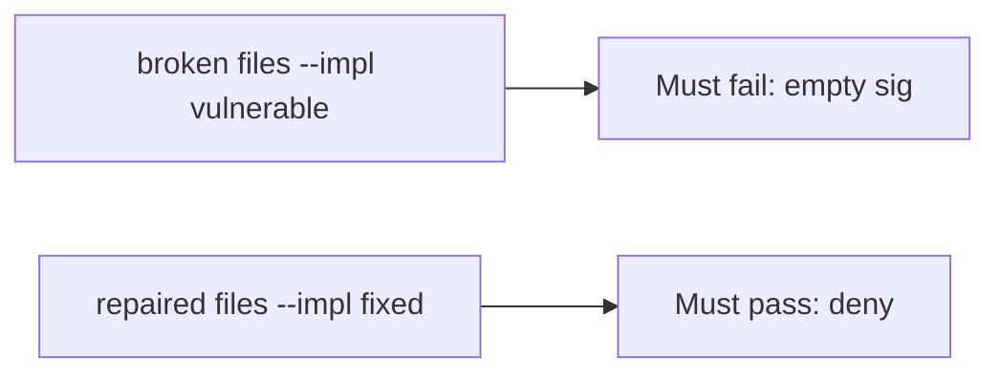

# Missing sig vs matching sig vs wrong sig

**Kind:** verification-lab
**Loop step:** 5 Verify

## Check it

A “webhooks are signed” slide does not reject an empty signature. TLS is a hop. `accept("", "body", "lab-secret")` has to be false, and a matching HMAC over the same raw body has to be true. Broken: the empty signature still returns true. Repair refuses a missing HMAC. Tests stay local. Do not hit live providers.

## Picture: empty sig on the broken files must fail the check

An unsigned body can still be accepted even when the suite is green.



If the broken webhook still passes, a missing sig was never rejected.

## What the check has to show

| Mode | Must show for this topic |
|---|---|
| Normal | Matching HMAC over the same raw body true (may pass on both) |
| Wrong input / abuse | Empty sig false; wrong sig false; broken must fail empty |
| Failure | If you cannot name the signature, do not accept |
| Not claimed | Replay window; parse-before-MAC; 1.2; live Stripe |

The test `test_missing_signature_is_rejected` is there so an always-true `accept` still fails.

An `hmac` import is not `accept("", "body", "lab-secret")`. This practice never POSTs a live webhook.

```text
python3 -m pytest labs/7.3/7.3-lab/tests --impl vulnerable
python3 -m pytest labs/7.3/7.3-lab/tests --impl fixed
```

A callback with a matching MAC may pass on both sides. You still have to deny a missing signature. If the broken files do not fail `test_missing_signature_is_rejected`, the lab is miswired — fix the wiring, not the assertion. A setup error is not proof the rule holds.

## What the tests do not prove

- Replay and freshness
- Per-message signatures beyond HMAC (advanced)
- That production hashes the raw body rather than parsed JSON (2.1)
- Outbound URL ownership (6.5)
- That a valid MAC still respects 1.2 on side effects

## Practice

Call `accept("", "body", "lab-secret")`. An `hmac` import is the library, not the empty-sig deny.

## Use it somewhere new

A 200 from `/webhook` does not prove an empty sig was denied. Do not send a live vendor POST.

## What this page is not doing

A live Stripe screenshot is not an empty signature denied. Do not log bodies or `lab-secret`. Answer keys are not on this site.
