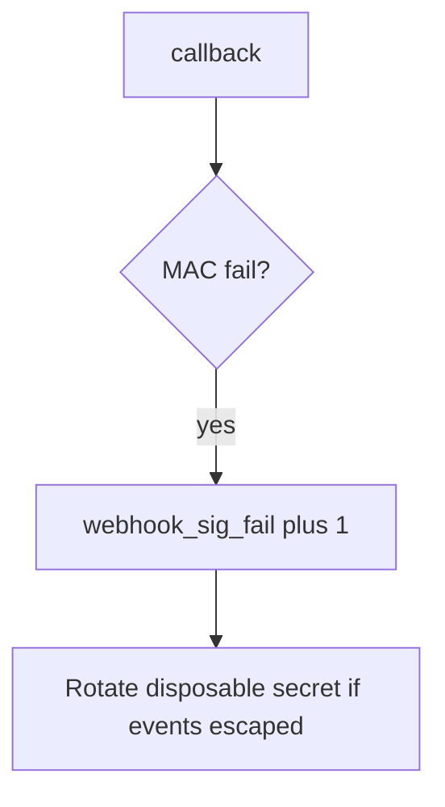

# Log the bad signature, not the body

**Kind:** operations-exercise
**Loop step:** 6 Operate

## Fixing it once is not enough

A new callback path can skip the MAC after `accept` hashes the body. Page the unsigned callback, cut the path, and keep the deny.

Skip callback bodies, `lab-secret`, and the HL7/JSON payload in the ticket. Do not POST a live webhook “to confirm.”

## Picture: a missing sig is a signal

If a callback is missing or has a wrong MAC, do not paste the body into the pager. Then keep the deny. Do not log the body.



A webhook-gateway product does not HMAC the callback.

## Signals that do not become a second leak

| Outcome | This topic |
|---|---|
| Notice | `webhook_sig_fail`; later `replay_window` |
| What the line holds | request id, provider id, reason; never body or secret |
| Respond | Keep the deny; rotate secret if events escaped |
| Recover | Keep deny; review accepted events; tighten 1.2 |
| Leftover | Replay; 6.5 egress; provider compromise; parse-before-MAC |

```text
log_denied reason=webhook_sig_fail provider=lab-billing request_id=req_73e
```

The raw body, `lab-secret`, a real patient result, or a live provider trace on that sample already dumps the callback.

Paste the raw body or `lab-secret` into the alert and the pager now holds a second copy of the 3.1 / 5.3 leak.

A “webhooks signed” checkbox does not reject a missing MAC. A missing MAC still has to fail `test_missing_signature_is_rejected`. Billing, export-ready, and invite-used callbacks still need the same missing-MAC deny.

Recovery is incomplete if the next route still returns true for an empty header. Grep callback paths the same day you keep the deny, and **do not POST a live provider** to confirm.

## What the framework does vs what you still have to check

An nginx dashboard will show TLS handshakes and stay silent when `/webhook` still returns true for an empty header. Detection must observe **empty sig false**, not HTTP status counts. If the alert includes the raw body or `lab-secret`, you have opened a leftover hole from topics 3.1 and 5.3. **Do not POST to confirm.**

## Practice

Log ids and a reason for the missing MAC — never the callback body. The raw body, `lab-secret`, a real patient result, or a live provider trace would reprint the callback.

## Use it somewhere new

Notice unsigned lab-result posts on local practice files; do not attach the HL7/JSON body to the ticket. Do not POST a live vendor.

## Usability

Provider retries on 5xx can amplify load (6.7). Return 4xx on a bad MAC so retries stop. Do not include the body in the error page. Status must not use color as the only cue.

## What this page is not doing

A web-filter product name does not verify the HMAC. Do not use live provider posts. This site does not mark you as finished. Answer keys are not on this site.
