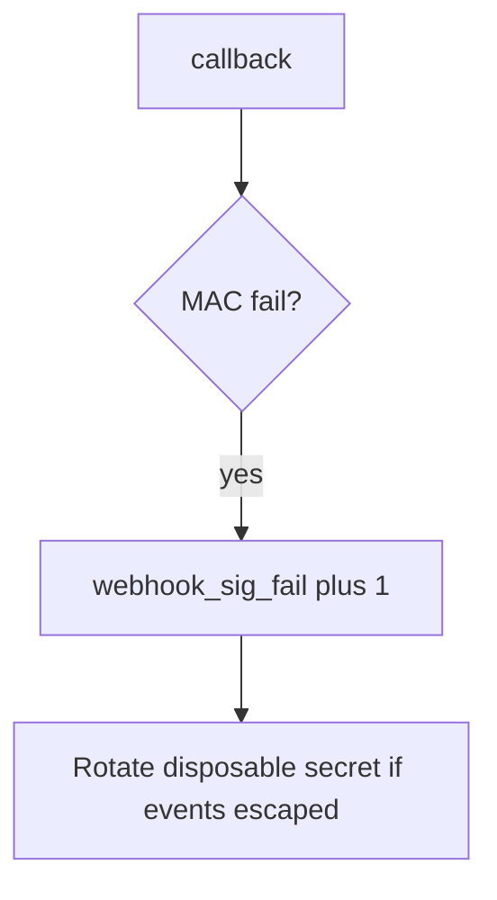

# Log the bad signature, not the body

**Kind:** operations-exercise
**Loop step:** 6 Operate

## Fixing it once is not enough

Even after `accept` was “fixed once,” a new callback path can skip the MAC. Running it for real is the rest of the loop: notice, contain, and keep the deny.

Do not log bodies or `lab-secret` (3.1 / 5.3). Do not attach the HL7/JSON body to the ticket. Do not POST a live webhook “to confirm.”

## Picture: a missing sig is a signal

A deny of a callback with a missing or wrong MAC still has to show up as an alert. Do not paste the body into the pager. Then keep the deny. Neither logs the body.



A vendor name does not compute the MAC. Someone still has to own every callback path.

## Signals that do not become a second leak

| Outcome | This topic |
|---|---|
| Notice | `webhook_sig_fail`; later `replay_window` |
| What the line holds | request id, provider id, reason; never body or secret |
| Respond | Keep the deny; rotate secret if events escaped |
| Recover | Keep deny; review accepted events; tighten 1.2 |
| Leftover | Replay; 6.5 egress; provider compromise; parse-before-MAC |

```text
log_denied reason=webhook_sig_fail provider=lab-billing request_id=req_73e
```

Not: the raw body, `lab-secret`, a real patient result, or a live provider trace.

If your alert includes the raw body or `lab-secret`, the pager now holds a second copy (3.1 / 5.3).

A green “webhooks signed” tile is not that check. Re-run `test_missing_signature_is_rejected` after any callback-route change. Billing, export-ready, and invite-used callbacks are other paths of the same MAC — inventory them before claiming recover.

Recovery is incomplete if the next route still returns true for an empty header. Grep callback paths the same day you keep the deny, and **do not POST a live provider** to confirm.

## What the framework does vs what you still have to check

An nginx dashboard will show TLS handshakes and stay silent when `/webhook` still returns true for an empty header. Detection must observe **empty sig false**, not HTTP status counts. If the alert includes the raw body or `lab-secret`, you have opened a leftover hole from topics 3.1 and 5.3. **Do not POST to confirm.**

## Practice

Write a log line (ids, reason, no body). Reject any line that includes the raw body, `lab-secret`, a real patient result, or a live provider trace.

## Use it somewhere new

A clinic example: notice unsigned lab-result posts on local practice files; do not attach the HL7/JSON body to the ticket. Do not POST a live vendor.

## Usability

Provider retries on 5xx can amplify load (6.7). Return 4xx on a bad MAC so retries stop. Do not include the body in the error page. Status must not use color as the only cue.

## What this page is not doing

A web-filter name is not this check. Do not use live provider posts. This site does not mark you as finished. Answer keys are not on this site.
