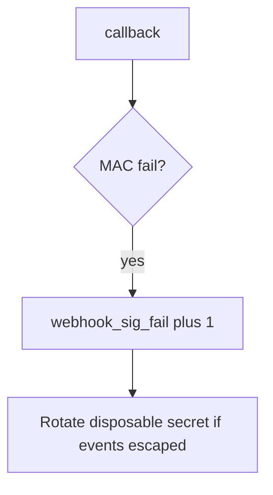

# 7.3-LO-06 — Detect webhook_sig_fail without logging the body

**Kind:** operations-exercise
**Loop step:** 6 Operate
**Standards:** NIST CSF 2.0 (final) DE/RS/RC as outcome labels; OWASP ASVS 5.0.0 (final) `v5.0.0-11.2.1`. CSF names outcomes; it does not compute the MAC.

## Prevention is not absolute

A new callback path can skip the MAC after `accept` was “fixed once.” Pair detect and recover. Do not log bodies or `lab-secret` (3.1 / 5.3). Do not attach the HL7/JSON body to the ticket.

## Mental model: missing sig is a signal



| Outcome | This module |
|---|---|
| Detect | `webhook_sig_fail`; later `replay_window` |
| Signal | request id, provider id, reason; never body or secret |
| Recover | Keep deny; rotate secret; review accepted events; tighten 1.2 |
| Residual | Replay; 6.5 egress; provider compromise; parse-before-MAC |

CSF 2.0 Detect / Respond / Recover name outcomes. They do not prove `v5.0.0-11.2.1`. A WAF product name is not the property. Re-run `test_missing_signature_is_rejected` after any callback-route change; a green “webhooks signed” tile is not that pytest. Billing, export-ready, and invite-consumed callbacks are other paths of the same MAC — inventory them before claiming Recover.

## Framework defaults versus the operate guarantee

An nginx dashboard will show TLS handshakes and stay silent when `/webhook` still returns true for an empty header. Detection must observe **empty sig false**, not HTTP status counts. If the alert includes the raw body or `lab-secret`, you have opened a 3.1 / 5.3 cell.

## Practice

Write one log line you would accept. Tie it to `labs/7.3/7.3-lab`.

```text
log_denied reason=webhook_sig_fail provider=lab-billing request_id=req_73e
```

Reject any line that includes the raw body, `lab-secret`, a real patient result, or a live provider trace.

## Transfer

Clinic: detect unsigned lab-result posts on a local fixture; do not attach the HL7/JSON body to the ticket. Do not POST a live vendor.

## Usability

Provider retries on 5xx can amplify load (6.7). Return 4xx on bad MAC so retries stop. Do not include the body in the error page (WCAG 2.2 Success Criterion 4.1.3).

## Non-goals

A WAF product name is not the property. Live provider posts are out of scope. Gates 0–10 stay not-attempted.
