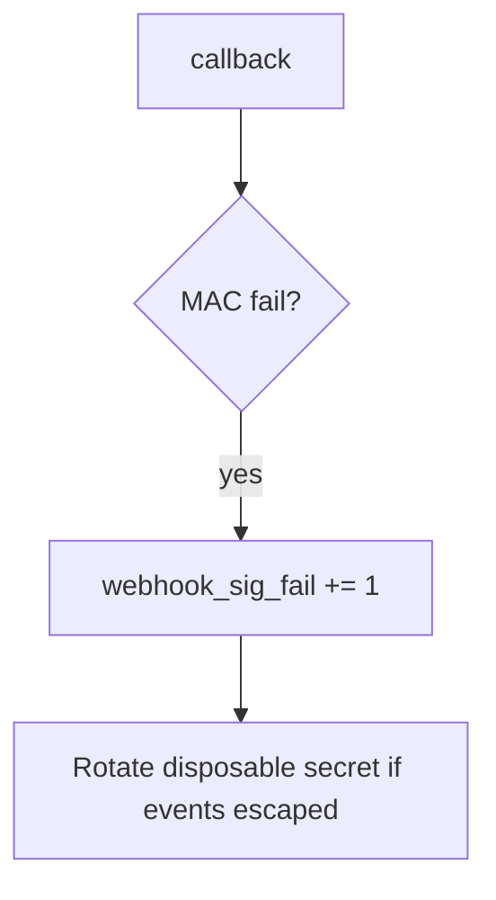

# 7.3-LO-06 — Detect webhook_sig_fail without logging the body

**Kind:** operations-exercise
**Loop step:** 6 Operate
**Standards:** NIST CSF 2.0 (final) DE/RS/RC as outcome labels; OWASP ASVS 5.0.0 (final) `v5.0.0-11.2.1`.

## Prevention is not absolute

A new callback path can skip the MAC. Pair detect and recover. Do not log bodies or `lab-secret` (3.1 / 5.3).

## Mental model: missing sig is a signal



| Outcome | This module |
|---|---|
| Detect | `webhook_sig_fail`; later `replay_window` |
| Signal | request id, provider id, reason; never body or secret |
| Recover | Keep deny; rotate secret; review accepted events; tighten 1.2 |
| Residual | Replay; 6.5 egress; provider compromise |

## Practice

Write one log line you would accept. Tie it to `labs/7.3/7.3-lab`.

```
log_denied reason=webhook_sig_fail provider=lab-billing request_id=req_73e
```

Reject any line that includes the raw body, `lab-secret`, a real patient result, or a live provider trace.

## Transfer

Clinic: detect unsigned lab-result posts; do not attach the HL7/JSON body to the ticket.

## Non-goals

A WAF product name is not the property.
