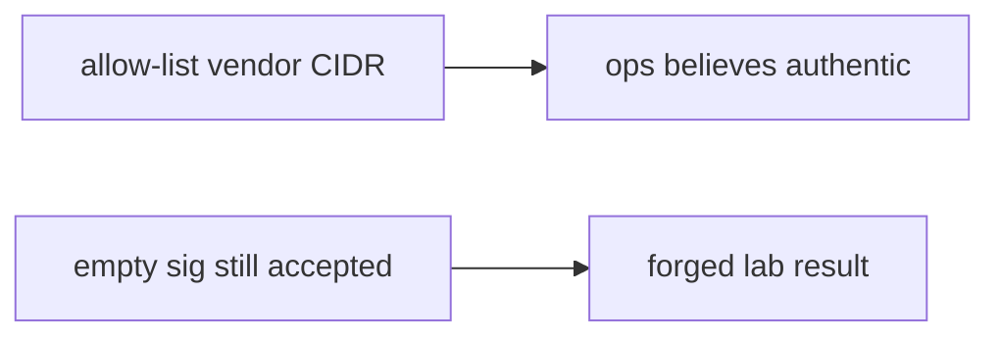

# 7.3-LO-07 — Transfer: clinic lab-result webhook

**Kind:** transfer-challenge
**Loop step:** 7 Transfer
**Standards:** OWASP ASVS 5.0.0 (final) `v5.0.0-11.2.1`. API10 awareness after. WCAG 2.2 for the deny message.

## Change the workplace; keep a raw-body MAC

Do not answer with a Top 10 / CWE / scanner as the definition of security. The SecureCollab sentence was: `accept("", "body", "lab-secret")` must be false. Rewrite it for a clinic without changing the fork.

**Prompt:** Clinic lab-result webhook. Also name signed redirects and outbound webhook SSRF (6.5).

**Product sketch:** EHR-lite `POST /lab-results` behind TLS, IP-allow-listed to “the lab vendor,” no MAC.

Rewrite the SecureCollab sentence. Include:

1. attacker capabilities (anyone who can POST the clinic callback URL — not a live clinic);
2. trust assumptions (raw-body HMAC + `compare_digest` is TCB; TLS and vendor CIDR are not);
3. forbidden outcome (`accept("", body, secret)` true, not “HIPAA”);
4. a test idea on a **local** fixture only (no live lab vendor);
5. residual (replay, parse-before-MAC, 1.2 on writing results, 6.5 if the clinic *calls out*, Level 3 signatures);
6. WCAG if a human retry path exists (do not dump the result payload into an error).

Use synthetic lab names. Do not instruct attacks on real hospital or vendor endpoints.

## Mental model: vendor IP is not a MAC

If the callback is TLS-terminated and CIDR-allow-listed while `accept` is always true, the cell is gone. FastAPI, nginx TLS, and a vendor SDK name do not hash the raw body. Parse-then-MAC (2.1) and outbound webhook URLs (6.5) are the same authenticity family — name them, do not run those systems here. A valid MAC still needs 1.2 on what the handler writes.

The clinic rewrite still has to keep the SecureCollab fork: empty sig false, matching HMAC over the same raw body true. Terminating TLS and allow-listing the vendor without a missing-sig test leaves `accept("", ...)` true. The local pytest analogue is `test_missing_signature_is_rejected` — on a fixture, not a live lab vendor POST.

## What graders reject

| Reject | Why |
|---|---|
| “TLS is on” | Hop, not message |
| Live clinic / Stripe / GitHub | Lab policy |
| “We use the vendor SDK” | Still need a missing-sig test over raw bytes |
| Vendor CIDR as authenticity | Shared-fate, not a MAC |
| HTTP 200 on `/webhook` as this cell | Wrong observation |

## Practice

One page. No keys. `labs/7.3/7.3-lab` is the only running system you may break. Do not POST a public host.

## Non-goals

Live-target webhooks. Real patient results. Claiming Gate 7 from this page.
