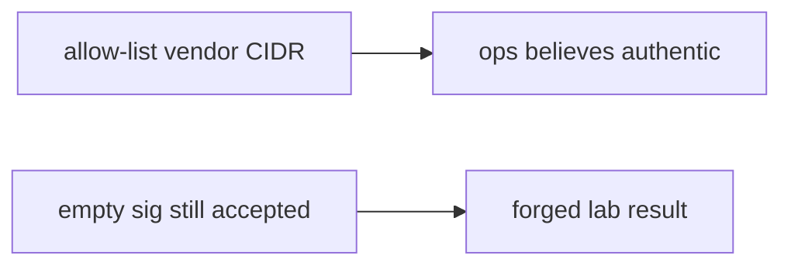

# Same idea on a clinic lab-result webhook

**Kind:** transfer-challenge
**Loop step:** 7 Transfer

## Use it somewhere new

You get a clinic that **accepts a lab-result webhook**.

`accept("", "body", "lab-secret")` must be false. HMAC over the raw body. For a clinic, the handler must not treat a POST that hit the path as proof the lab sent it.

Also name signed redirects and outbound webhook SSRF (6.5) as the same authenticity family, without running those systems.

## Picture: the vendor’s IP range is still not a MAC

The lab-result POST is the billing webhook.

| Notes app | Clinic sketch |
|---|---|
| Billing / export-ready / invite-used callback | Lab-result POST on `/lab-results` |
| `accept` | Same check before any write |
| HMAC over raw body + `compare_digest` | Same MAC before `json.loads` |
| Anyone who can POST the URL | Anyone who can POST the clinic callback — **not** a live clinic |

If the callback is TLS-terminated and address-range-allow-listed while `accept` is always true, the check is gone. FastAPI, nginx TLS, and a vendor SDK name do not hash the raw body. Parse-then-MAC (2.1) and outbound webhook URLs (6.5) are the same authenticity family — name them, do not run those systems here. A valid MAC still needs 1.2 on what the handler writes.

An empty sig still has to be false. A matching HMAC over the same raw body may still be true. Terminating TLS and allow-listing the vendor without a missing-sig test leaves `accept("", ...)` true. The local check is `test_missing_signature_is_rejected` — on a practice, not a live lab vendor POST.

## Write this for a clinic lab-result webhook

EHR-lite `POST /lab-results` behind TLS, IP-allow-listed to “the lab vendor,” no MAC.

1. who might try (anyone who can POST the clinic callback URL — not a live clinic);
2. what you trust (raw-body HMAC + `compare_digest`; TLS and vendor address range are not);
3. what must not happen (`accept("", body, secret)` true);
4. a missing signature does not accept — **local** practice files (never on the real lab vendor);
5. leftover (replay, parse-before-MAC, 1.2 on writing results, 6.5 if the clinic *calls out*, advanced signatures beyond HMAC);
6. whether a human-read deny must not dump the result payload into an error (readable status, not the lab JSON on the page).

Use synthetic lab names. Do not instruct attacks on real hospital or vendor endpoints.

## What is not good enough

| Reject | Why |
|---|---|
| “TLS is on” | Hop, not message |
| Live clinic / Stripe / GitHub | Course rules |
| “We use the vendor SDK” | Still need a missing-sig test over raw bytes |
| Vendor address range as authenticity | Shared-fate, not a MAC |
| HTTP 200 on `/webhook` as this check | Wrong observation |

## Practice

Reject the callback that is missing a MAC. Keep the answer keys closed. The only running system you may break is `labs/7.3/7.3-lab`. Do not POST a public host.

## What this page is not doing

Do not try live-target webhooks. Do not use real patient results. This page does not finish a check-in.
