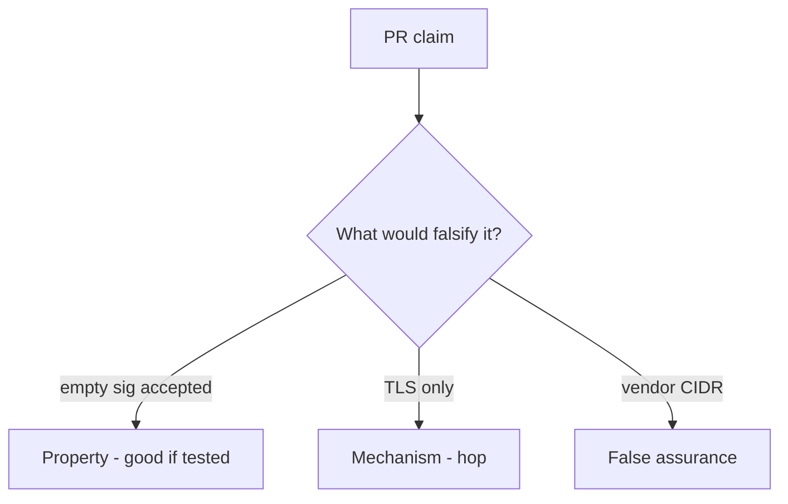

# 7.3-LO-08 — Review path-trusted callbacks as a PR, not an API10 ticket

**Kind:** code-review
**Loop step:** Review
**Standards:** OWASP ASVS 5.0.0 (final) `v5.0.0-11.2.1`.

## Review the fixture as if it were SecureCollab billing webhook

Review `labs/7.3/7.3-lab/vulnerable/` as a SecureCollab PR. Intended findings live only in `content/assessment/keys/7.3.md` — not here.

## Mental model: Accept always true / process because path matched

Start with this seeded smell: **Accept always true / process because path matched**. Label it property, mechanism, or false assurance before you accept the PR.

Seeded smells (label them yourself; do not open the keys file):

- Accept always true / process because path matched
- JSON parsed before MAC
- No missing-sig test
- Secret in query string (4.3)

Also reject: live provider attacks, keys in lessons, real webhook secrets.

## Misconceptions

- TLS to us proves the sender
- IP allow-list is authenticity
- Webhooks are just APIs in reverse so JWT login applies

## Practice

Write three review notes. Tie at least one to `test_missing_signature_is_rejected`.

## Transfer

Clinic PR that “terminated TLS and allow-listed the vendor” without a missing-sig test is incomplete.
