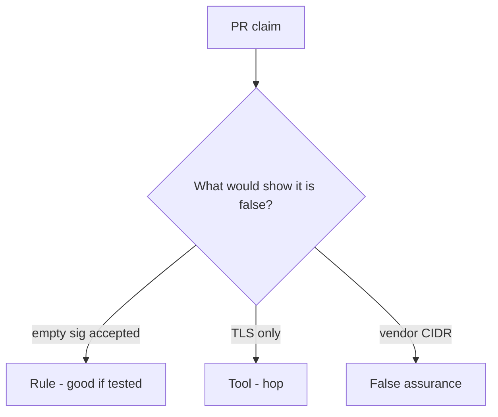

# Would you merge this path-trusted callbacks?

**Kind:** code-review
**Loop step:** Review

## What you are reviewing

The files in `labs/7.3/7.3-lab/vulnerable/` are the billing-webhook change. Does `accept("", "body", "lab-secret")` still return true?

“Will HMAC later” is a promise. `test_missing_signature_is_rejected` is the evidence. A famous-bugs ticket does not verify the signature.

## Picture: accept always true / process because the path matched

**Accept always true / process because the path matched**.

An empty sig still has to be denied. If the change never checks a raw-body MAC, that path-trust is still open. A TLS terminator without that check is still the same problem.

Parse-before-MAC (2.1) and secret-in-query (4.3) are other authenticity holes — name them, do not skip `test_missing_signature_is_rejected`.

## Problems to find (name them yourself)

- Accept always true / process because the path matched
- JSON parsed before MAC
- No missing-sig test
- Secret in query string (4.3)

Also reject: live provider attacks; closing findings without re-running `test_missing_signature_is_rejected`; keys in learner notes; a web filter as the rule.

## Common mix-ups

- TLS to us proves the sender
- An IP allow-list is authenticity
- Webhooks are just APIs in reverse so JWT login applies
- Vendor SDK verify is the same as a custom MAC over parsed JSON
- A famous-bugs label verifies HMAC

## Use it somewhere new

TLS and a vendor allow-list, without a missing-sig test, still trust the path. TLS does not replace a missing-sig deny — write that deny.

## What this page is not doing

You cannot waive a missing signature with “will HMAC later.” Assign an owner or keep the finding open. Do not POST a live provider to prove the finding.
