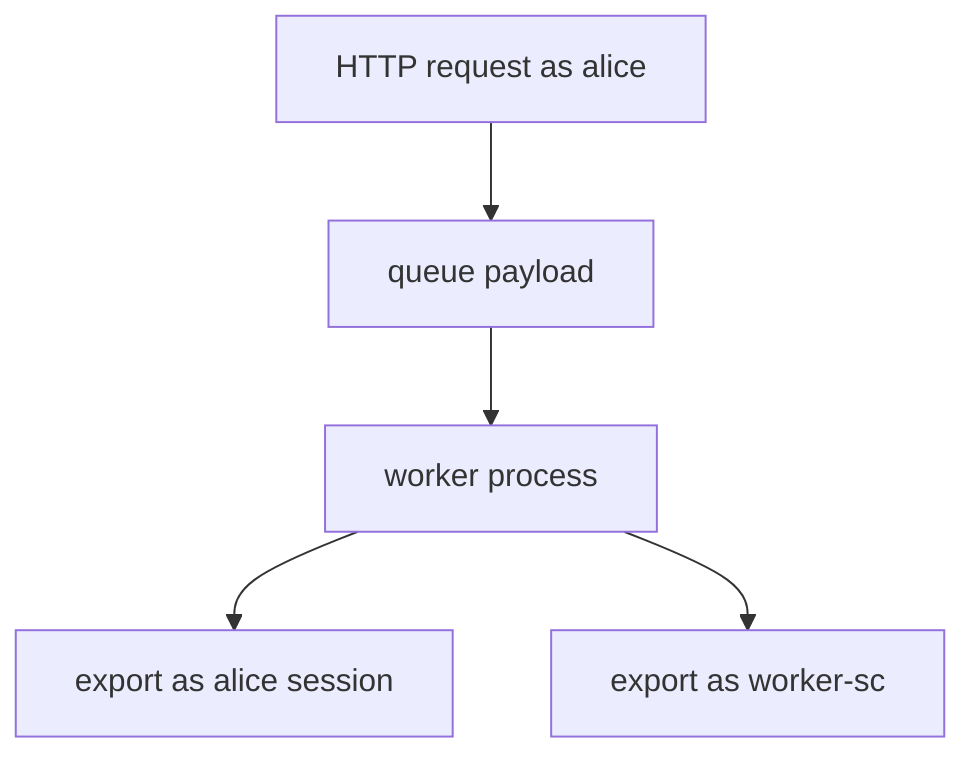
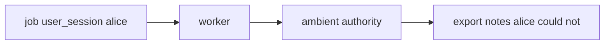

# A leftover user session is not worker identity

**Kind:** concept-model
**Loop step:** 1 Property

## The rule

The notes app can export after the web request is already over. Export still has a budget from the quota lesson (6.7). The overnight job is a **worker**, not Alice’s leftover login. A leftover cookie, or a `user_session` stuffed into the job, must not become the worker’s identity. That is a confused deputy: the queue message’s user field must not impersonate the worker.

> `exporter({"user_session": "alice", "service": None})` must be `None`. `exporter({"service": "worker-sc"})` may be `"worker-sc"`.

What must not happen is **a leftover user session accepted as worker identity**. That is who the worker is allowed to be. It is also leftover Alice still exporting after delete-and-revoke (4.1).

Backend jobs should log in as their own short-lived service accounts, not leftover people. Those accounts should be small. After the worker is the worker, it may still need Alice’s grant (4.4) to choose *which* notes. That later check is **advanced** work. Do not collapse “the worker must not *be* Alice” with “the worker must still *check* Alice’s grant.”

## Picture: HTTP subject versus worker principal



A task library that copies the web request into the job is a trap: the task looks like it is still the user.

## Picture: confused deputy



If the worker’s database role is god-mode (3.3), the deputy is worse: it can read every company.

**The tool (not the rule):** an “internal” queue, a private network, a zero-trust product name, or signed broker messages.

## Why it happens, what it costs, how you stop it, how you notice, how you recover

| Slice | For this rule |
|---|---|
| Why it happens | Ambient user context in a system worker |
| What has to be true first | `exporter({user_session: alice})` succeeds |
| Trigger | Job with leftover session or inherited request context |
| What it costs | User cookie drives privileged export; stale user still exports |
| How you stop it | Jobs name `service=worker-sc`; workers authenticate as that principal |
| How you notice | `worker_identity_wrong` |
| How you recover | Revoke service creds; drain the queue |

## What the framework does vs what you still have to check

A task library can copy the request into the later job. FastAPI `Depends()` is gone once the HTTP worker returns. A message broker on a private network is still untrusted input (2.1).

What this practice is supposed to show: leftover Alice is `None`; the named worker may run. Practice files are in `labs/7.4/7.4-lab`. Fake job dicts only. No live broker.

## What the tool cannot do

- A correctly named worker that is still a superuser database role (3.3).
- Poison-message loops, and retries of revoked grants (2.4).
- After the worker is `worker-sc`, it may still need Alice’s grant (4.4) to choose which notes — that later check is advanced work, not this check.
- Broker access lists wait for 10.3.
- A zero-trust architecture paper does not replace the check.

## Can people still use it

“Export ready” email must not imply the worker ran “as you” if it ran as the service. Failure to enqueue should be something a screen reader can announce, not a silent retry storm (6.7).

## Practice

Trace one export: who is the subject at HTTP vs worker. Then run:

```text
python3 -m pytest labs/7.4/7.4-lab/tests --impl vulnerable
python3 -m pytest labs/7.4/7.4-lab/tests --impl fixed
```

## Use it somewhere new

Clinic batch-export worker. Outbox. Event schemas.

## What this page is not doing

Do not use live broker attacks, dumping task-library exploits into notes. This site does not mark you as finished. Answer keys are not on this site.
