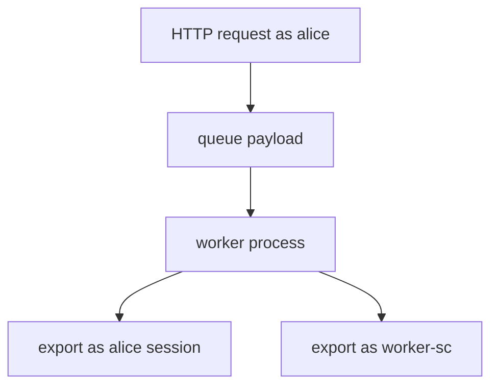
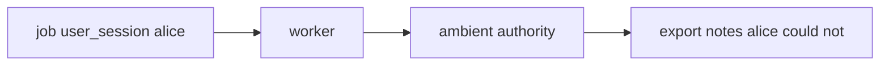

# 7.4-LO-01 — Leftover user session is not worker identity

**Kind:** concept-model
**Loop step:** 1 Property
**Standards:** OWASP ASVS 5.0.0 (final) `v5.0.0-13.2.1`, `v5.0.0-13.2.2`; `v5.0.0-8.3.3` is **Level 3, advanced**. NIST SP 800-207 is architecture *guidance*, not a product.

## The claim this module owns

SecureCollab export can run in a worker after the HTTP request returns (6.7 quota still applies). The worker is a **service principal**. A leftover cookie or `user_session` stuffed into the job must not become ambient authority. That is a confused deputy: the queue message’s user field must not impersonate the worker.

> `exporter({"user_session": "alice", "service": None})` must be `None`. `exporter({"service": "worker-sc"})` may be `"worker-sc"`.

The forbidden outcome is **user session accepted as worker identity**. That is authorization of the worker plane, plus stale-user export after 4.1 revoke.

ASVS `v5.0.0-13.2.1` wants backend components authenticated with individual service accounts or short-term tokens, not leftover user sessions. `v5.0.0-13.2.2` wants those accounts least-privileged. `v5.0.0-8.3.3` (access based on the *originating* subject through an intermediary) is **Level 3, advanced** — named so learners do not collapse “worker must not *be* alice” with “worker must still *check* alice’s grant.”

## Mental model: HTTP subject versus worker principal



Celery (or similar) inheriting request context is a trap: the task looks like it is still the user.

## Mental model: confused deputy



If the worker DB role is god-mode (3.3), the deputy is worse: it can read every tenant.

**Mechanism (not the property):** “internal queue,” “VPC,” “zero-trust product,” “Celery signed messages.”

## Root cause vs impact vs prevention vs detection vs recovery

| Slice | For this property |
|---|---|
| Root cause | Ambient user context in a system worker |
| Preconditions | `exporter({user_session: alice})` succeeds |
| Trigger | Job with leftover session or inherited request context |
| Impact | User cookie drives privileged export; stale user still exports |
| Prevention | Jobs name `service=worker-sc`; workers authenticate as that principal |
| Detection | `worker_identity_wrong` |
| Recovery | Revoke service creds; drain queue |

## Framework defaults versus the worker guarantee

Celery can copy the request context into the task. FastAPI Depends() is gone once the HTTP worker returns. A message broker inside the VPC is still untrusted input (2.1).

## Mechanism limits

- Service role that is still god-mode (3.3).
- Poison-message loops and 2.4 retries of revoked grants.
- Originating-subject carry-through (`v5.0.0-8.3.3`, Level 3) is a *different* cell: after the worker is `worker-sc`, it may still need alice’s 4.4 grant to choose *which* notes.
- Broker ACLs wait for 10.3.
- NIST SP 800-207 does not replace the pytest oracle.

## Usability and accessibility

Export-ready emails must not imply the worker ran “as you” if it ran as service. Failure to enqueue should be readable (WCAG 2.2 4.1.3), not a silent retry storm (6.7).

## Practice

Trace one export: who is the subject at HTTP vs worker. Then run:

```
python3 -m pytest labs/7.4/7.4-lab/tests --impl vulnerable
python3 -m pytest labs/7.4/7.4-lab/tests --impl fixed
```

The first command must fail. The second must pass.

## Transfer

Clinic batch-export worker. Outbox. Event schemas.

## Non-goals

Live broker attacks, dumping Celery exploits into notes. Gates 0–10 and milestones M0–M5 stay **not-attempted**. Answer keys are not in this file.
