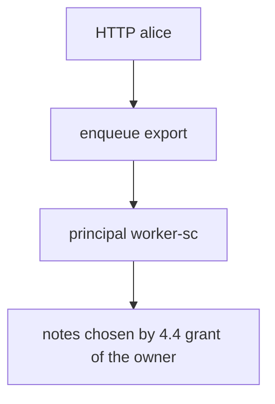
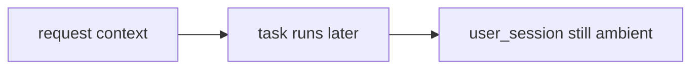

# 7.4-LO-02 — HTTP subject versus worker principal

**Kind:** design-exercise
**Loop step:** 2 Model
**Standards:** OWASP ASVS 5.0.0 (final) `v5.0.0-13.2.1`, `v5.0.0-13.2.2`.

## Can a second engineer name pytest cases from your identity trace?

“Jobs run internally” is not this lesson. A reviewable model names **who authenticates the worker and what the job is allowed to carry**.

SecureCollab Phase 1 freeze: local `exporter(job)` with principal `worker-sc`. No live brokers.

## Mental model: two principals

The enqueueing user is a *parameter* (which export). It is not the worker’s login.

## Mental model: inherit-request-context trap

## Step 1: freeze pieces

| Piece | This system |
|---|---|
| Subjects | alice (HTTP); `worker-sc` (service) |
| Objects | export job; note bodies |
| Actions | `exporter` |
| Channels | in-process job dict (lab stand-in for a queue) |
| TCB | worker accepts only `service == worker-sc` |
| Untrusted | job payload; inherited cookies |
| State / time | delay; 2.4 retry; 4.1 revoke |
| 1.1 cell | authorization of the worker plane |

## Step 2: write cells

| Subject | Object | Action | Decision |
|---|---|---|---|
| `worker-sc` | export | run | allow |
| `user_session` alice, no service | export | run | deny |
| alice + wrong service | export | run | deny |
| god-mode DB role | all tenants | SELECT | 3.3 residual |
| retry after revoke | notes | export | 2.4 residual |

## Practice

Draw the trace. Point at `labs/7.4/7.4-lab` file `worker.py`.

## Transfer

Outbox pattern; event schemas that still carry `user_id` as data, not as login.

## Residual risk

`v5.0.0-8.3.3` Level 3 originating subject; poison loops; 7.2 field dumps from the worker; 5.3 hardcoded worker defaults.

## Non-goals

Top 10 as the definition of security. Keys stay out of lessons.
