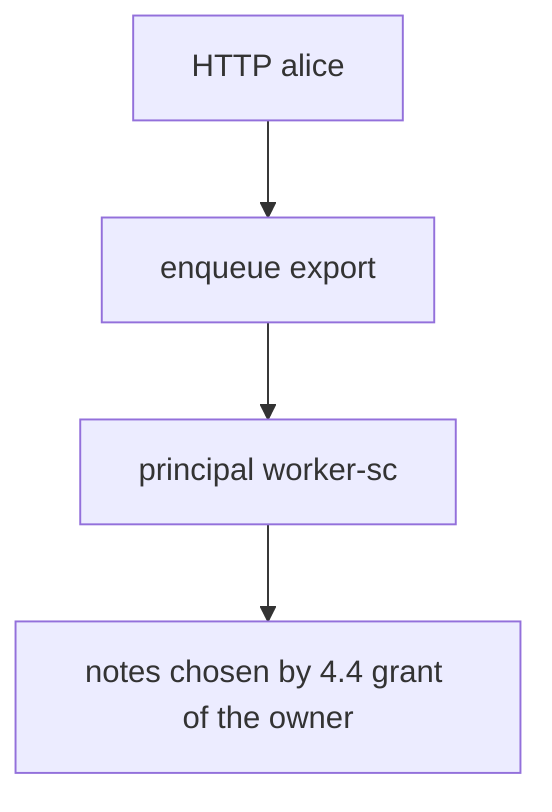
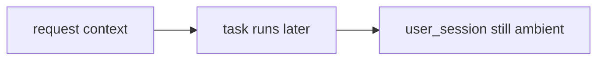

# HTTP subject versus worker principal

**Kind:** design-exercise
**Loop step:** 2 Model

## Could someone else name the checks?

“Jobs run internally” is not this lesson. A map someone else can test names **who authenticates the worker** and **what the job is allowed to carry**.

This week’s freeze: local `exporter(job)` with principal `worker-sc`. No live brokers.

> The person who clicked Export is a *parameter* (which export). It is not the worker’s login. Leftover Alice with no service is denied. The named worker may run.

## Picture: enqueue principal versus execute principal

Alice on the web request is who asked. The worker that runs later is `worker-sc`. Mixing those two is the hole.

## Picture: inherit-request-context trap

A leftover cookie that rides into the later task still looks like Alice. It is not the worker.

## Step 1: name the pieces

| Piece | This system |
|---|---|
| Who | alice (HTTP); `worker-sc` (service) |
| What | export job; note bodies |
| Actions | `exporter` |
| Paths | in-process job dict (lab stand-in for a queue) |
| What you trust | worker accepts only `service == worker-sc` |
| What you do not trust | job payload; inherited cookies |
| Time | delay; retry (2.4); revoke (4.1) |
| The rule | leftover user session is not worker identity |

## Step 2: write allow and deny

| Who | What | Action | Decision |
|---|---|---|---|
| `worker-sc` | export | run | allow |
| `user_session` alice, no service | export | run | deny |
| alice + wrong service | export | run | deny |
| god-mode DB role | all companies | SELECT | leftover: 3.3 |
| retry after revoke | notes | export | leftover: 2.4 |

A missing “Alice session × deny” row is how a leftover login becomes the worker. Write the hole.

## Practice

Draw the trace so someone else could name the checks. Point at `labs/7.4/7.4-lab` file `worker.py`. Fake job dicts only.

## Use it somewhere new

Outbox pattern. Event schemas that still carry `user_id` as data, not as login.

## What can still go wrong

After the worker is the worker, choosing notes from Alice’s grant is advanced work, not this check. Poison loops. Field dumps from the worker (7.2). Hardcoded worker defaults (5.3).

## What this page is not doing

Do not run this map against a live clinic or a public broker. Answer keys are not on this site.
