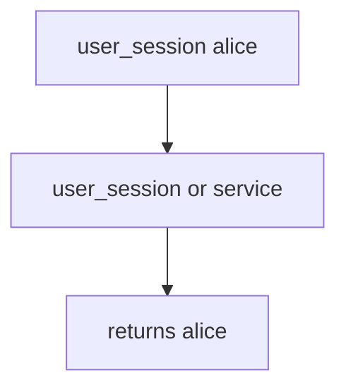

# 7.4-LO-03 — Observe user_session fallback, do not trophy a live broker

**Kind:** mechanism-lab
**Loop step:** 3 Break
**Standards:** OWASP ASVS 5.0.0 (final) `v5.0.0-13.2.1`. Least-privilege service accounts (`v5.0.0-13.2.2`) are a paired grain. Originating-subject carry-through (`v5.0.0-8.3.3`) is **Level 3, advanced**. NIST SP 800-207 is architecture guidance, not a product.

## Authorized scope

`labs/7.4/7.4-lab` only. The fixture is an in-process `exporter(job)`. Synthetic job dicts (`alice`, `worker-sc`). No live Redis, RabbitMQ, or Celery. Do not attach to a public broker.

**Forbidden outcome:** User session accepted as worker identity. `exporter({"user_session": "alice", "service": None})` returns `"alice"`.

Attacker capability in this lab: a leftover cookie stuffed into a job, or inherited request context. That stands in for a clinic “Export overnight” that copies the clinician cookie into the task so “the job knows who asked.” Trust assumption: `exporter` is supposed to authenticate as a **named service principal**. A VPC, an “internal” queue, and a zero-trust dashboard are not in the TCB for this cell.

## Mental model: leftover cookie wins



The vulnerable tree demonstrates **cause** (ambient user context). Do not attach to anything except this fixture. Preconditions: `exporter` returns `user_session` if present. You do not need a broker. You must not attach to a live queue.

ASVS `v5.0.0-13.2.1` wants backend components authenticated with individual service accounts, not leftover user sessions. Module 4.1 already revoked leftover HTTP sessions; this cell is **whether the worker still is that session**. NIST SP 800-207 does not replace the pytest.

## What to read in the fixture

`vulnerable/worker.py` returns `user_session` if present. Tests:

- `test_user_session_is_not_worker_identity`
- `test_service_principal_is_worker_identity`
- `test_alice_and_wrong_service_is_rejected` — mixed leftover plus wrong service

You do not need a new identity string. The failure of `test_user_session_is_not_worker_identity` *is* the evidence.

Do not open the fixed tree yet. Diagnose the cause first.

## Root cause vs impact vs prevention vs detection vs recovery

| Slice | This lab |
|---|---|
| Required property | `exporter({"user_session": "alice", "service": None})` is `None` |
| Root cause | Ambient user context in a system worker |
| Preconditions | `user_session or service` fallback runs |
| Trigger | Job with leftover session or inherited request context |
| Impact | Export attributed to alice’s session; stale user still exports after 4.1 revoke |
| Prevention | Jobs name `service=worker-sc`; workers authenticate as that principal |
| Detection | `worker_identity_wrong`; never the cookie |
| Recovery | Keep deny; rotate worker creds; drain queue |
| Not the lesson | Zero-trust sticker as the definition; live Celery; god-mode DB role (3.3) as this oracle |

## Framework defaults versus the worker guarantee

Celery can copy the request context into the task. FastAPI `Depends()` is gone once the HTTP worker returns. A message broker inside the VPC is still untrusted input (2.1). Next.js never sees the overnight job. The application guarantee is: **this** fixture, alice session yields `None`.

## Practice

```text
python3 -m pytest labs/7.4/7.4-lab/tests --impl vulnerable
```

Run from `labs/7.4/7.4-lab` if a repo-root collection picks up `site/`. Record `test_user_session_is_not_worker_identity`. Do not probe public hosts. An environment error is not security evidence.

## Transfer

Clinic batch-export. Predict without leaving this directory. Do not attach to a live hospital broker.

## Non-goals

No live-target instructions. Synthetic identities only (`alice`, `worker-sc`). Do not dump Celery exploits into notes.
