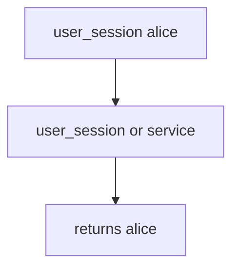

# Practice: a user session accepted as worker identity

**Kind:** mechanism-lab
**Loop step:** 3 Break

## Try it

The practice is not a website you attack. `exporter` does not open a live queue: leftover `user_session` wins if it is present, even when no broker is running.

> A leftover user session is not worker identity. `exporter({"user_session": "alice", "service": None})` must be `None`. `exporter({"service": "worker-sc"})` may be `"worker-sc"`.

## Where you may practice

Stay inside `labs/7.4/7.4-lab`. Fake job dicts (`alice`, `worker-sc`). It does not talk to Redis, RabbitMQ, or a live task library.

Do not attach to a public broker. Do not probe an employer queue. Do not probe a classmate preview. Do not paste a live cookie “to see what happens.”

What must not happen: a user session accepted as worker identity. `exporter({"user_session": "alice", "service": None})` returns `"alice"`.

Picture a leftover cookie stuffed into a job, or inherited request context — a clinic “Export overnight” that copies the clinician cookie into the task so “the job knows who asked.” `exporter` authenticates as a **named service principal**. A private network, an “internal” queue, and a zero-trust dashboard are not enough.

## Picture: leftover cookie wins



User context is ambient. Do not aim anything except this practice. `exporter` returns `user_session` if present. You do not need a broker. You must not attach to a live queue.

Backend jobs should log in as their own accounts, not leftover people. Module 4.1 already revoked leftover HTTP sessions. This check is **whether the worker still is that session**. A zero-trust paper does not replace the check.

## What to look at: the cause, not a hunt

`vulnerable/worker.py` returns `user_session` if present. Tests:

- `test_user_session_is_not_worker_identity`
- `test_service_principal_is_worker_identity`
- `test_alice_and_wrong_service_is_rejected` — leftover plus wrong service


| What you see | What kind of failure | Not the lesson |
|---|---|---|
| `exporter` returns `"alice"` | Ambient user context | A zero-trust sticker |
| `user_session or service` fallback | Leftover cookie wins | “The queue is internal” |
| Overnight job still is Alice | What must not happen | A live broker attach |

## Why it happens, what it costs, how you stop it, how you notice, how you recover

| Slice | This practice |
|---|---|
| The rule | `exporter({"user_session": "alice", "service": None})` is `None` |
| Why it happens | Ambient user context in a system worker |
| What's already wrong | `user_session or service` fallback runs |
| Trigger | Job with leftover session or inherited request context |
| What it costs | Export attributed to Alice’s session; stale user still exports after 4.1 revoke |
| How you stop it | Jobs name `service=worker-sc`; workers authenticate as that principal |
| How you notice | `worker_identity_wrong`; never the cookie |
| How you recover | Keep deny; rotate worker creds; drain the queue |
| Not the lesson | A zero-trust sticker, a live task library, or a god-mode database role (3.3) as this check |

## What the framework does vs what you still have to check

A task library can copy the request into the later job. FastAPI `Depends()` is gone once the HTTP worker returns. A message broker on a private network is still untrusted input (2.1). Next.js never sees the overnight job. Alice session yields `None`.

## Practice

```text
python3 -m pytest labs/7.4/7.4-lab/tests --impl vulnerable
```

Run from `labs/7.4/7.4-lab` if a repo-root collection picks up `site/`. Do not probe public hosts. A setup error is not proof the rule holds.

## Use it somewhere new

Clinic batch-export. Predict without leaving this directory. Do not attach to a live hospital broker.

## What this page is not doing

No live-target instructions. Fake identities only (`alice`, `worker-sc`). Do not dump task-library exploits into notes. Do not “fix” the practice by deleting the test.
