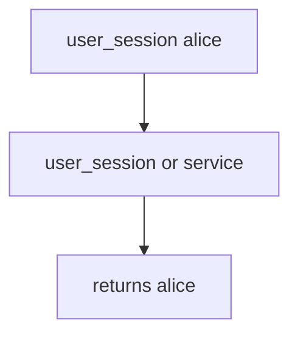

# 7.4-LO-03 — Observe user_session fallback, do not trophy a live broker

**Kind:** mechanism-lab
**Loop step:** 3 Break
**Standards:** OWASP ASVS 5.0.0 (final) `v5.0.0-13.2.1`.

## Authorized scope

`labs/7.4/7.4-lab` only. Synthetic job dicts. No live Redis/RabbitMQ.

**Forbidden outcome:** User session accepted as worker identity.

## Mental model: leftover cookie wins



The vulnerable tree demonstrates **cause** (ambient user context). Do not attach to anything except this fixture.

## What to read in the fixture

`vulnerable/worker.py` returns `user_session` if present. Tests require `exporter({"user_session": "alice", "service": None})` to be `None`.

## Root cause vs impact

| Slice | Lab |
|---|---|
| Root cause | Ambient user context in a system worker |
| Impact | Export attributed to alice’s session |
| Not the lesson | Zero-trust sticker as the definition |

## Practice

```
python3 -m pytest labs/7.4/7.4-lab/tests --impl vulnerable
```

Record `test_user_session_is_not_worker_identity`. Do not probe public hosts.

## Transfer

Clinic batch-export. Predict without leaving this directory.

## Non-goals

No live-target instructions. Synthetic identities only (`alice`, `worker-sc`).
