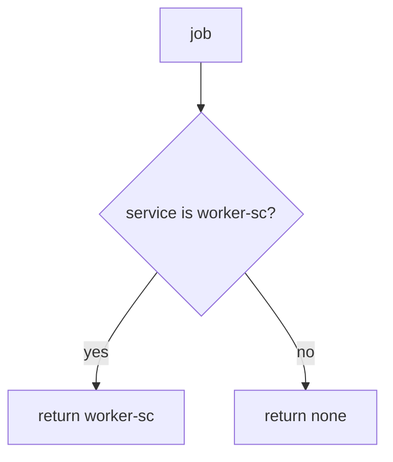

# 7.4-LO-04 — Bind exporter to worker-sc only

**Kind:** design-exercise
**Loop step:** 4 Build
**Standards:** OWASP ASVS 5.0.0 (final) `v5.0.0-13.2.1`, `v5.0.0-13.2.2`. Originating-subject carry-through (`v5.0.0-8.3.3`) is **Level 3, advanced**. NIST SP 800-207 is guidance, not a product.

## Structural means the worker authenticates as a service principal

`exporter` must return `"worker-sc"` only when `service == "worker-sc"`. Leftover `user_session` is ignored. Structural means that check — not “the queue is internal,” not a VPC, not a zero-trust dashboard, not signed broker messages as a substitute for the principal.

The smallest restore for SecureCollab overnight export is: alice session yields `None`. Fail-safe: missing service denies. A fallback `user_session or service` is the bug. Do not fail open because the broker was “inside the VPC.”

## Mental model: service or nothing



The lab’s fixed tree returns `"worker-sc"` only on an exact service match. Production still needs a least-privileged DB role for that principal (`v5.0.0-13.2.2` / 3.3): a correctly named worker that is still god-mode can read every tenant. Originating-subject carry-through (`v5.0.0-8.3.3`, Level 3 advanced) is a *different* cell: after the worker is `worker-sc`, it may still need alice’s 4.4 grant to choose *which* notes. Broker ACLs wait for 10.3.

ASVS `v5.0.0-13.2.1` wants that individual service account. This pytest is that sentence for leftover alice.

## Why this restores the cell

| After the fix | Must be true |
|---|---|
| alice session, no service | `None` |
| `service=worker-sc` | `"worker-sc"` |
| alice + wrong service | `None` |

## What this is not

God-mode DB role (3.3) as this oracle. Originating-subject token pass-through (`v5.0.0-8.3.3`, Level 3). Signed broker messages as a substitute for principal checks. NIST SP 800-207 as a product. VLAN as identity.

## Mechanism limits

- Service role that is still god-mode (3.3).
- Poison-message loops and 2.4 retries of revoked grants.
- Originating-subject carry-through (`v5.0.0-8.3.3`, Level 3 advanced) is a different cell.
- 7.2 field dumps from the worker serializer.
- 5.3 leftover default worker credentials.
- Broker ACLs wait for 10.3.
- NIST SP 800-207 does not replace the pytest oracle.

## Practice

Name the predicate (`service == "worker-sc"`; leftover session ignored). Run:

```text
python3 -m pytest labs/7.4/7.4-lab/tests --impl fixed
```

Must pass. Run from the lab directory if collection at repo root is polluted.

## Transfer

Clinic: stop treating “the batch job runs on the hospital VLAN” as worker identity.

## Residual risk

Poison loops; 2.4 retry of revoked grants; 7.2 dumps; 5.3 default worker credentials; 10.3 broker ACLs; god-mode DB role; Level 3 originating subject.

## Non-goals

Do not attach to a live broker. Do not claim Gate 7 from a zero-trust screenshot.
