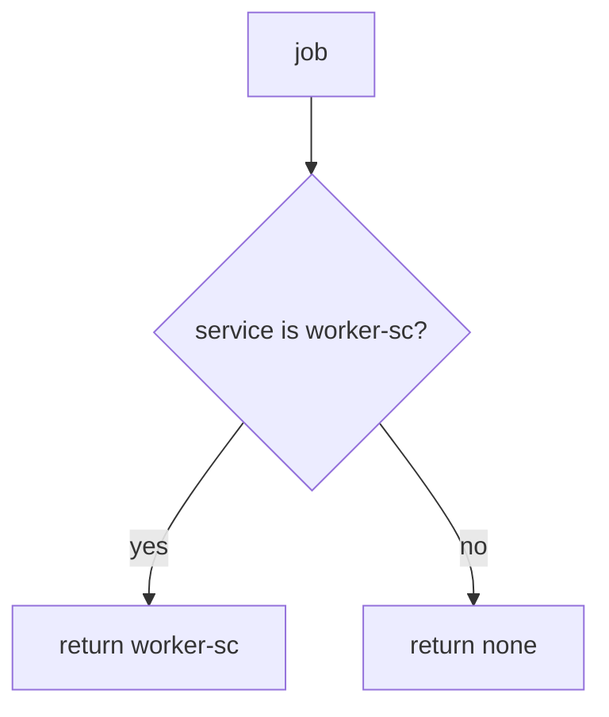

# Bind the exporter to the worker only

**Kind:** design-exercise
**Loop step:** 4 Build

## The rule

An “internal” queue does not bind who the exporter is. A private network does not bind it. A zero-trust dashboard does not bind it. Signed broker messages still are not who the worker is.

In short, the worker authenticates as a service principal. `exporter` must return `"worker-sc"` only when `service == "worker-sc"`. Leftover `user_session` is ignored.

Overnight export needs this: Alice session yields `None`. A missing service denies. A fallback `user_session or service` is the bug. Keep it closed even if the broker was “inside the private network.”

## Picture: service or nothing



`exporter` returns `"worker-sc"` only on an exact service match. A correctly named worker that is still god-mode can read every company — that principal still needs a least-privileged database role (3.3). After the worker is `worker-sc`, it may still need Alice’s grant (4.4) to choose *which* notes. That later check is advanced work, not this check. Broker access lists wait for 10.3.

Use that individual service account — leftover Alice.

## What the repaired files must show

Do not treat `fixed/worker.py` as a production broker.

| After the fix | Must be true |
|---|---|
| alice session, no service | `None` |
| `service=worker-sc` | `"worker-sc"` |
| alice + wrong service | `None` |

If the job does not name the worker, the answer is deny. An “internal” queue does not name the worker.

## What this is not

God-mode database role (3.3) as this check. Passing Alice’s login through the worker as a later grant check (advanced). Signed broker messages as a substitute for the principal. A zero-trust paper as a product. VLAN as identity.

## What the tool cannot do

- Service role that is still god-mode (3.3).
- Poison-message loops and retries of revoked grants (2.4).
- After the worker is the worker, choosing notes from Alice’s grant is a different rule.
- Field dumps from the worker serializer (7.2).
- Leftover default worker credentials (5.3).
- Broker access lists wait for 10.3.
- A zero-trust architecture paper does not replace the check.

## Practice

Name the check (`service == "worker-sc"`; leftover session ignored). Run:

```text
python3 -m pytest labs/7.4/7.4-lab/tests --impl fixed
```

## Use it somewhere new

Stop treating “the batch job runs on the hospital VLAN” as worker identity.

## What can still go wrong

Poison loops; retry of revoked grants (2.4); field dumps (7.2); default worker credentials (5.3); broker access lists (10.3); god-mode database role; the later originating-subject check (advanced).

## What this page is not doing

Do not attach to a live broker. Do not treat a zero-trust screenshot as a finished check-in.
