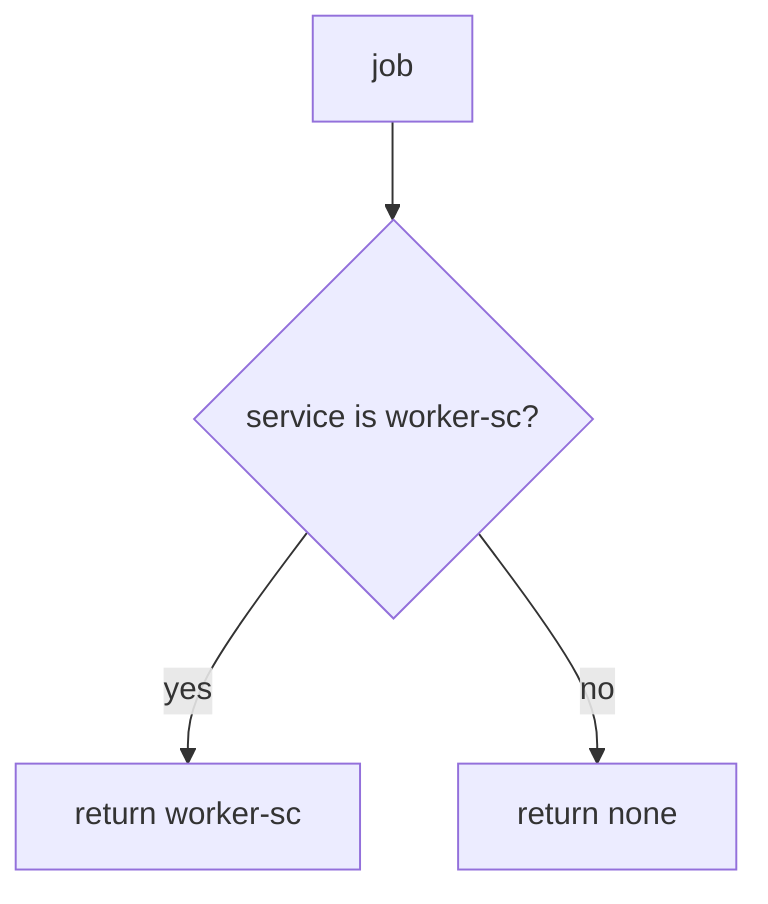

# Bind the exporter to the worker only

**Kind:** design-exercise
**Loop step:** 4 Build

## The rule

An “internal” queue is not the fix. A private network is not the fix. A zero-trust dashboard is not the fix. Signed broker messages are not a substitute for who the worker is.

Structural means the worker authenticates as a service principal. `exporter` must return `"worker-sc"` only when `service == "worker-sc"`. Leftover `user_session` is ignored.

The smallest restore for notes-app overnight export is: Alice session yields `None`. Fail closed: missing service denies. A fallback `user_session or service` is the bug. Do not fail open because the broker was “inside the private network.”

## Picture: service or nothing



The lab’s repaired files return `"worker-sc"` only on an exact service match. Production still needs a least-privileged database role for that principal (3.3): a correctly named worker that is still god-mode can read every company. After the worker is `worker-sc`, it may still need Alice’s grant (4.4) to choose *which* notes. That later check is advanced work, not this check. Broker access lists wait for 10.3.

Industry lists ask for that individual service account. The check below is that sentence for leftover Alice.

## What the repaired files must show

Read `fixed/worker.py` against this checklist. Do not treat the snippet as a production broker.

| After the fix | Must be true |
|---|---|
| alice session, no service | `None` |
| `service=worker-sc` | `"worker-sc"` |
| alice + wrong service | `None` |

Fail closed: if the job does not name the worker, the answer is deny. Uncertainty is a **no**, not a yes because the queue was “internal.”

## What this is not

God-mode database role (3.3) as this check. Passing Alice’s login through the worker as a later grant check (advanced). Signed broker messages as a substitute for the principal. A zero-trust paper as a product. VLAN as identity.

## What the tool cannot do

- Service role that is still god-mode (3.3).
- Poison-message loops and retries of revoked grants (2.4).
- After the worker is the worker, choosing notes from Alice’s grant is a different rule.
- Field dumps from the worker serializer (7.2).
- Leftover default worker credentials (5.3).
- Broker access lists wait for 10.3.
- A zero-trust architecture paper does not replace the pytest.

## Practice

Name the check (`service == "worker-sc"`; leftover session ignored). Run:

```text
python3 -m pytest labs/7.4/7.4-lab/tests --impl fixed
```

It must pass. Run from the lab directory if collection at repo root is polluted. Then write one sentence: which rule is restored, and which leftover you refused to delete.

## Use it somewhere new

A clinic example: stop treating “the batch job runs on the hospital VLAN” as worker identity.

## What can still go wrong

Poison loops; retry of revoked grants (2.4); field dumps (7.2); default worker credentials (5.3); broker access lists (10.3); god-mode database role; the later originating-subject check (advanced).

## What this page is not doing

Do not attach to a live broker. Do not claim a course gate from a zero-trust screenshot.
