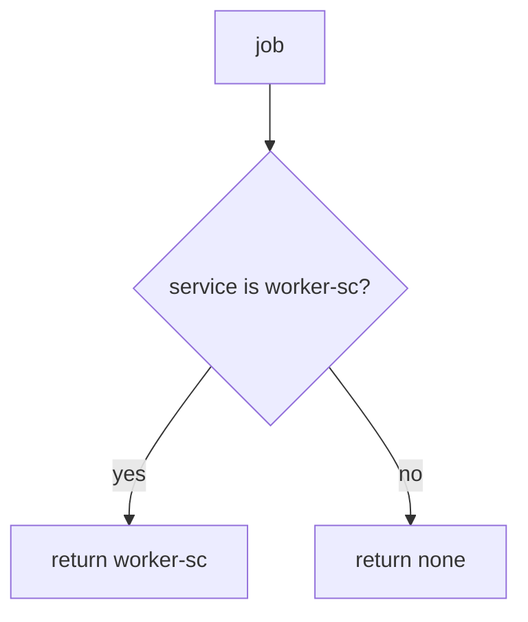

# 7.4-LO-04 — Bind exporter to worker-sc only

**Kind:** design-exercise
**Loop step:** 4 Build
**Standards:** OWASP ASVS 5.0.0 (final) `v5.0.0-13.2.1`, `v5.0.0-13.2.2`.

## Structural means the worker authenticates as a service principal

`exporter` must return `"worker-sc"` only when `service == "worker-sc"`. Leftover `user_session` is ignored. Structural means that check — not “the queue is internal,” not a VPC, not a zero-trust dashboard.

## Mental model: service or nothing



Fail-safe: missing service denies. A fallback `user_session or service` is the bug.

## Why this restores the cell

| After the fix | Must be true |
|---|---|
| alice session, no service | `None` |
| `service=worker-sc` | `"worker-sc"` |
| alice + wrong service | `None` |

## What this is not

God-mode DB role (3.3). Originating-subject token pass-through (`v5.0.0-8.3.3`, Level 3). Signed broker messages as a substitute for principal checks. NIST SP 800-207 as a product.

## Practice

Name the predicate. Run:

```
python3 -m pytest labs/7.4/7.4-lab/tests --impl fixed
```

Must pass.

## Transfer

Clinic: stop treating “the batch job runs on the hospital VLAN” as worker identity.

## Residual risk

Poison loops; 2.4 retry of revoked grants; 7.2 dumps; 5.3 default worker credentials; 10.3 broker ACLs.
