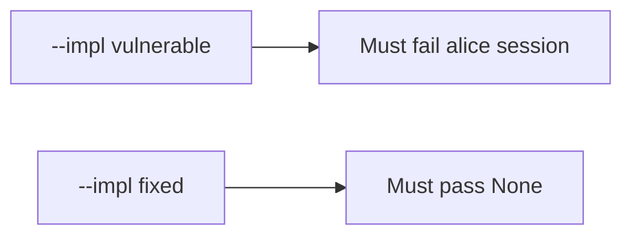

# 7.4-LO-05 — Evidence is alice denied, then a passing pair

**Kind:** verification-lab
**Loop step:** 5 Verify
**Standards:** OWASP ASVS 5.0.0 (final) `v5.0.0-13.2.1`.

## An invariant that cannot fail a test is still a slogan

“Workers use a service account” is not evidence. “The queue is internal” is a mechanism observation. The oracle is: `exporter({"user_session": "alice", "service": None})` is `None` and `exporter({"service": "worker-sc"})` is `"worker-sc"`. The alice-session observation must be **false** on `--impl vulnerable` (returns `"alice"`) and **true** on `--impl fixed`. Do not attach to live brokers.

## Mental model: vulnerable must fail: alice session

The failing observation on `--impl vulnerable` is **alice session**. A passing collection count is not this cell.



| Mode | Must show for this module |
|---|---|
| Negative / abuse | alice session, no service → `None`; vulnerable must fail |
| Normal | `service=worker-sc` → `"worker-sc"` (may pass on both) |
| Mixed | alice + wrong service → `None` |
| Not claimed | originating-subject Level 3; poison loops; live Celery |

Lab tests in `labs/7.4/7.4-lab/tests/test_property.py`. `test_user_session_is_not_worker_identity` is a **forbidden-outcome** test: a leftover cookie that becomes the principal is not allowed to count as a passing control.

```text
python3 -m pytest labs/7.4/7.4-lab/tests --impl vulnerable
python3 -m pytest labs/7.4/7.4-lab/tests --impl fixed
```

Honest `service=worker-sc` may pass on both implementations. That does not excuse the leftover-session deny test. If vulnerable does not fail `test_user_session_is_not_worker_identity`, the lab is miswired—fix the wiring, not the assertion.

## What the tests do not prove

- Originating-subject carry-through (`v5.0.0-8.3.3`, Level 3 advanced)
- Least-privilege DB role in production (`v5.0.0-13.2.2` beyond the principal name)
- 2.4 retry after 4.1 revoke
- Broker ACLs (10.3)
- That Celery in production does not re-copy request context
- NIST SP 800-207 as a product check

Record those as residuals or later modules, not as silent passes.

## Practice

Execute both implementations this session from the lab directory if needed. Write the fail/pass pair next to the matrix row. Reject a “test” that only greps `worker-sc` in a YAML file without calling `exporter({"user_session": "alice", "service": None})`.

## Transfer

Clinic: a test that only asserts the job was enqueued is not this cell. A live broker attach is out of scope.

## Non-goals

Do not add a live Celery trophy. Do not log session cookies. Keys stay out of this file.
