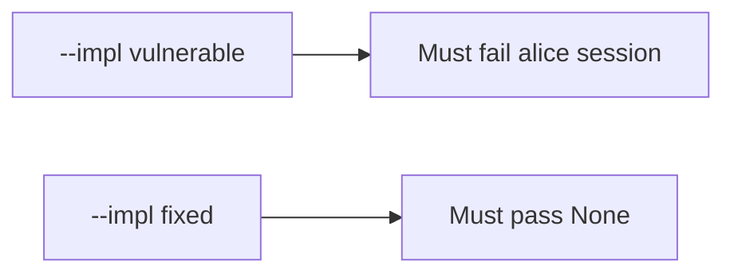

# 7.4-LO-05 — Evidence is alice denied, then a passing pair

**Kind:** verification-lab
**Loop step:** 5 Verify
**Standards:** OWASP ASVS 5.0.0 (final) `v5.0.0-13.2.1`.

## An invariant that cannot fail a test is still a slogan

“Workers use a service account” is not evidence. The oracle is the local pair. Do not attach to live brokers.

## Mental model: fail-on-vulnerable, pass-on-fixed



| Case | Must show |
|---|---|
| Negative / abuse | alice session, no service → `None` |
| Normal | `service=worker-sc` → `"worker-sc"` |
| Mixed | alice + wrong service → `None` |
| Not claimed | originating-subject Level 3; poison loops; live Celery |

```
python3 -m pytest labs/7.4/7.4-lab/tests --impl vulnerable
python3 -m pytest labs/7.4/7.4-lab/tests --impl fixed
```

Honest `service=worker-sc` may pass on both.

## What the tests do not prove

- Originating-subject carry-through (`v5.0.0-8.3.3`, Level 3)
- Least-privilege DB role in production (`v5.0.0-13.2.2` beyond the principal name)
- 2.4 retry after 4.1 revoke
- Broker ACLs (10.3)

## Practice

Execute both implementations. Map each test to an LO-02 cell.

## Transfer

Clinic: a test that only asserts the job was enqueued is not this cell.
