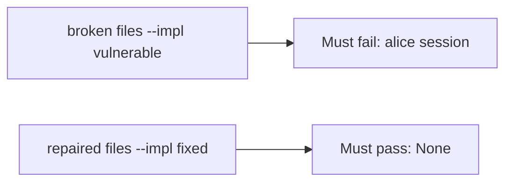

# Alice session denied; worker allowed

**Kind:** verification-lab
**Loop step:** 5 Verify

## Until you can fail it, it is still a slogan

“Workers use a service account” is not evidence. “The queue is internal” is a tool observation. The check is: `exporter({"user_session": "alice", "service": None})` is `None` and `exporter({"service": "worker-sc"})` is `"worker-sc"`. The Alice-session observation must be **false** on the broken files (returns `"alice"`) and **true** on the repaired files. Do not attach to live brokers.

## Picture: leftover Alice must fail the check

A check that only counts passing cases can still look green while leftover Alice still becomes the worker. The broken files have to fail that case. The repaired files have to pass it.



If both pass, the test is not looking at leftover Alice. If both fail, the fix is not structural or the check is wrong.

## Four modes, even for one principal

| Mode | Must show for this topic |
|---|---|
| Normal | `service=worker-sc` → `"worker-sc"` (may pass on both) |
| Wrong input / abuse | alice session, no service → `None`; broken files must fail |
| Mixed | alice + wrong service → `None` |
| Not claimed | later originating-subject check (advanced); poison loops; live task library |

The file is `labs/7.4/7.4-lab/tests/test_property.py`. The test `test_user_session_is_not_worker_identity` exists so a leftover cookie that becomes the principal cannot count as a pass.

A test that only asserts the job was enqueued is not this topic’s evidence. A test that only greps `worker-sc` in a YAML file without calling `exporter({"user_session": "alice", "service": None})` is not this topic’s evidence. This practice never opens a public broker.

```text
python3 -m pytest labs/7.4/7.4-lab/tests --impl vulnerable
python3 -m pytest labs/7.4/7.4-lab/tests --impl fixed
```

Honest `service=worker-sc` may pass on both implementations. That does not excuse the leftover-session deny test. If the broken files do not fail `test_user_session_is_not_worker_identity`, the lab is miswired — fix the wiring, not the assertion. A setup error is not proof the rule holds.

## What the tests do not prove

- After the worker is the worker, choosing notes from Alice’s grant (advanced, not this check)
- Least-privilege database role in production (beyond the principal name) (3.3)
- Retry after revoke (2.4 / 4.1)
- Broker access lists (10.3)
- That a production task library does not re-copy request context
- A zero-trust paper as a product check

Record those as leftover or later topics, not as silent passes.

## Practice

Run both this session from the lab directory if needed:

```text
python3 -m pytest labs/7.4/7.4-lab/tests --impl vulnerable
python3 -m pytest labs/7.4/7.4-lab/tests --impl fixed
```

Paste nothing from answer keys. Write fail/pass into your notes next to the matrix row. Reject a “test” that only greps `worker-sc` in a YAML file without calling `exporter({"user_session": "alice", "service": None})`.

## Use it somewhere new

A clinic example: a test that only asserts the job was enqueued is not this check. A live broker attach is out of scope.

## What this page is not doing

Do not add a live task-library trophy. Do not log session cookies. Answer keys are not on this site.
