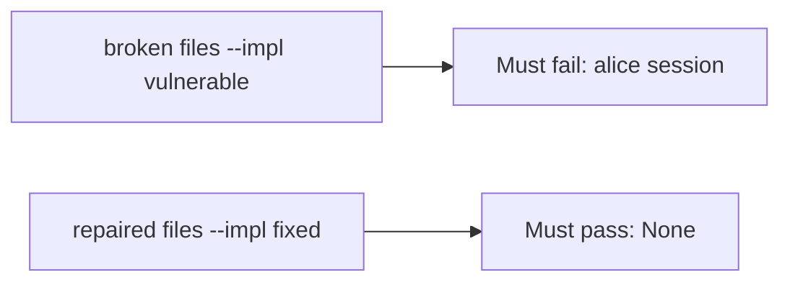

# Alice session denied; worker allowed

**Kind:** verification-lab
**Loop step:** 5 Verify

## Check it

“Workers use a service account” is not evidence. “The queue is internal” is a tool observation. The check is: `exporter({"user_session": "alice", "service": None})` is `None` and `exporter({"service": "worker-sc"})` is `"worker-sc"`. The Alice-session observation must be **false** on the broken files (returns `"alice"`) and **true** on the repaired files. Do not attach to live brokers.

## Picture: leftover Alice must fail the check

A passing-test tally can still hide that leftover Alice still becomes the worker.



If both pass, you are not looking at leftover Alice.

## What the check has to show

| Mode | Must show for this topic |
|---|---|
| Normal | `service=worker-sc` → `"worker-sc"` (may pass on both) |
| Wrong input / abuse | alice session, no service → `None`; broken files must fail |
| Mixed | alice + wrong service → `None` |
| Not claimed | later originating-subject check (advanced); poison loops; live task library |

The test `test_user_session_is_not_worker_identity` is there so a leftover cookie that becomes the principal still fails.

A test that only asserts the job was enqueued is not this topic’s evidence. A test that only greps `worker-sc` in a YAML file without calling `exporter({"user_session": "alice", "service": None})` is not this topic’s evidence. This practice never opens a public broker.

```text
python3 -m pytest labs/7.4/7.4-lab/tests --impl vulnerable
python3 -m pytest labs/7.4/7.4-lab/tests --impl fixed
```

Honest `service=worker-sc` may pass on both implementations. That does not excuse the leftover-session deny test. If the broken files do not fail `test_user_session_is_not_worker_identity`, the lab is miswired — fix the wiring, not the assertion. A setup error is not proof the rule holds.

## What the tests do not prove

- After the worker is the worker, choosing notes from Alice’s grant (advanced, not this check)
- Least-privilege database role in production (beyond the principal name) (3.3)
- Retry after revoke (2.4 / 4.1)
- Broker access lists (10.3)
- That a production task library does not re-copy request context
- A zero-trust paper as a product check

## Practice

```text
python3 -m pytest labs/7.4/7.4-lab/tests --impl vulnerable
python3 -m pytest labs/7.4/7.4-lab/tests --impl fixed
```

Reject a “test” that only greps `worker-sc` in a YAML file without calling `exporter({"user_session": "alice", "service": None})`.

## Use it somewhere new

A clinic example: a test that only asserts the job was enqueued is not this check. A live broker attach is out of scope.

## What this page is not doing

Do not treat a live task-library screenshot as proof. Do not log session cookies. Answer keys are not on this site.
