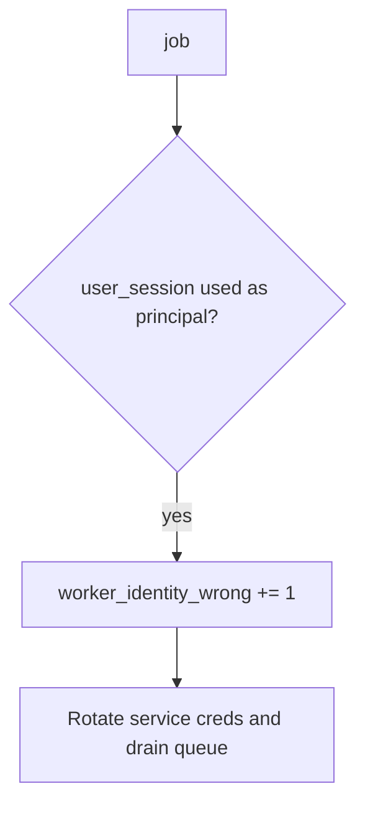

# 7.4-LO-06 — Detect worker_identity_wrong without logging the cookie

**Kind:** operations-exercise
**Loop step:** 6 Operate
**Standards:** NIST CSF 2.0 (final) DE/RS/RC as outcome labels; OWASP ASVS 5.0.0 (final) `v5.0.0-13.2.1`.

## Prevention is not absolute

A new task can inherit request context again. Pair detect and recover. Do not log session cookies or note bodies (3.1 / 4.3).

## Mental model: leftover session is a signal



| Outcome | This module |
|---|---|
| Detect | `worker_identity_wrong`; `poison_queue` |
| Signal | request/job id, expected principal; never the cookie |
| Recover | Keep deny; rotate worker creds; drain; re-check 4.1 revoke vs 2.4 retry |
| Residual | God-mode DB role; Level 3 originating subject; 10.3 broker ACLs |

## Practice

Write one log line you would accept. Tie it to `labs/7.4/7.4-lab`.

```
log_denied reason=worker_identity_wrong expected=worker-sc job_id=job_74e
```

Reject any line that includes `alice`’s session cookie, note bodies, or a live broker dump.

## Transfer

Clinic: detect batch-export jobs running as a clinician session; do not attach the session token to the ticket.

## Non-goals

A zero-trust product name is not the property.
