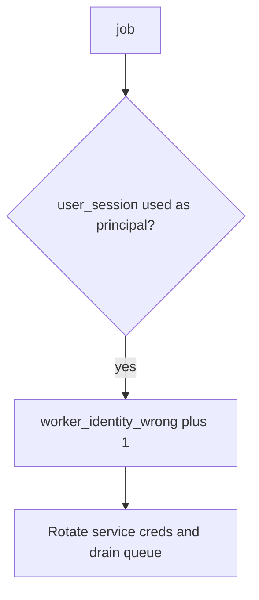

# Log the wrong worker identity, not the cookie

**Kind:** operations-exercise
**Loop step:** 6 Operate

## Fixing it once is not enough

Even after `exporter` was “fixed once,” a new task can inherit request context again. Running it for real is the rest of the loop: notice, contain, and recover.

Do not log session cookies or note bodies (3.1 / 4.3). Do not attach the token to the ticket.

## Picture: leftover session is a signal

A leftover cookie used as the principal still has to be noticed. Leave the cookie out of the pager. Recovery should keep the deny and rotate the worker.



A zero-trust product name does not bind the principal. Someone still has to own the worker identity.

## Signals that do not become a second leak

| Outcome | This topic |
|---|---|
| Notice | `worker_identity_wrong`; `poison_queue` |
| What the line holds | request/job id, expected principal — **never** the cookie |
| Respond | Keep deny |
| Recover | Rotate worker creds; drain; re-check revoke (4.1) vs retry (2.4); re-run `test_user_session_is_not_worker_identity` |
| Leftover | God-mode database role (3.3); later originating-subject check (advanced); broker access lists (10.3) |

```text
log_denied reason=worker_identity_wrong expected=worker-sc job_id=job_74e
```

Not: Alice’s session cookie, note bodies, a live broker dump, or a real clinician token.

If your alert includes Alice’s cookie or note bodies, the pager now holds a second copy.

A green “service account enabled” tile is not that check. Overnight export, outbox, and notification fan-out are other jobs of the same principal — inventory them before claiming recover. Re-run `test_user_session_is_not_worker_identity` after any task-enqueue change.

## What the framework does vs what you still have to check

A task dashboard will show task success and stay silent when the task still used `job.get('user_session')`. Detection must observe **Alice session yields `None`**, not queue depth. If the alert includes Alice’s cookie or note bodies, you have opened a leftover hole from topics 3.1 and 4.3.

## Practice

Write a log line (job id, expected principal, no cookie). Reject any line that includes Alice’s session cookie, note bodies, or a live broker dump.

## Use it somewhere new

A clinic example: notice batch-export jobs running as a clinician session on local practice files; do not attach the session token to the ticket. Do not attach to a live broker.

## Can people still use it

“Export ready” email must not imply the worker ran “as you” if it ran as the service. Failure to enqueue should be something a screen reader can announce, not a silent retry storm (6.7).

## What this page is not doing

Naming a zero-trust product is not the rule. Do not use live broker attaches are out of scope. This site does not mark you as finished. Answer keys are not on this site.
