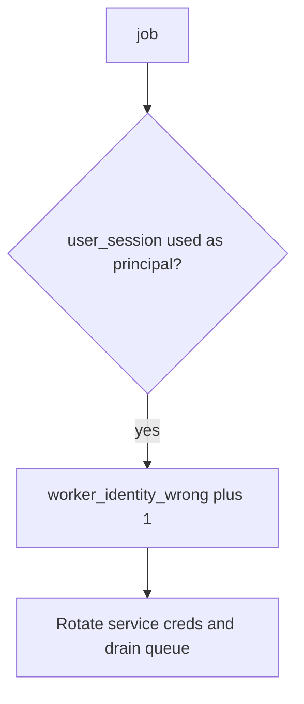

# Log the wrong worker identity, not the cookie

**Kind:** operations-exercise
**Loop step:** 6 Operate

## Fixing it once is not enough

A new task can inherit the request cookie after `exporter` is bound to the service. Page the Alice-session export, stop the worker, and restore the service bind.

Session cookies, note bodies, and the leftover token do not go in the ticket.

## Picture: leftover session is a signal

If a leftover cookie is used as the principal, keep the cookie out of the pager. Then keep the deny and rotate the worker.



A zero-trust sticker does not stop a leftover cookie from being the worker.

## Signals that do not become a second leak

| Outcome | This topic |
|---|---|
| Notice | `worker_identity_wrong`; `poison_queue` |
| What the line holds | request/job id, expected principal — **never** the cookie |
| Respond | Keep deny |
| Recover | Rotate worker creds; drain; re-check revoke (4.1) vs retry (2.4); re-run `test_user_session_is_not_worker_identity` |
| Leftover | God-mode database role (3.3); later originating-subject check (advanced); broker access lists (10.3) |

```text
log_denied reason=worker_identity_wrong expected=worker-sc job_id=job_74e
```

Alice’s session cookie, note bodies, a live broker dump, or a real clinician token in the sample already names the principal.

Alice’s cookie or note bodies in the worker ticket are the principal again.

Enabling a service account does not stop a leftover cookie from being the principal. Overnight export, outbox, and notification fan-out can still inherit Alice’s cookie; do not rotate the worker until those jobs are named. A job that carries Alice’s cookie still has to fail `test_user_session_is_not_worker_identity`.

## What the framework does vs what you still have to check

Queue success is not a check that the task dropped `job.get('user_session')`. Detection must observe **Alice session yields `None`**, not queue depth. Alice’s cookie or note bodies next to Alice-session-yields-None reopen topics 3.1 and 4.3.

## Practice

Log the job id and expected principal — never the leftover cookie. Alice’s session cookie, note bodies, and a live broker dump name the worker.

## Use it somewhere new

Notice batch-export jobs running as a clinician session on local practice files; do not attach the session token to the ticket. Do not attach to a live broker.

## Can people still use it

“Export ready” email must not imply the worker ran “as you” if it ran as the service. Failure to enqueue should be something a screen reader can announce, not a silent retry storm (6.7).

## What this page is not doing

A zero-trust sticker does not bind worker identity. Do not use live broker attaches. This site does not mark you as finished. Answer keys are not on this site.
