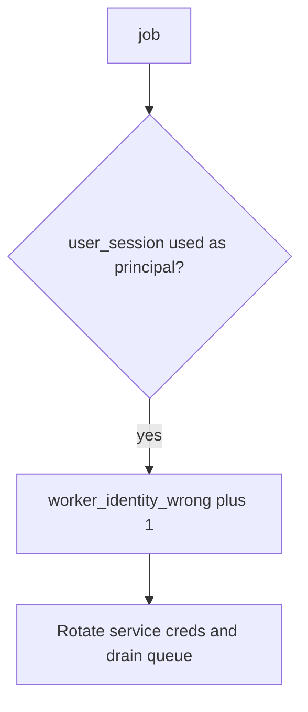

# 7.4-LO-06 — Detect worker_identity_wrong without logging the cookie

**Kind:** operations-exercise
**Loop step:** 6 Operate
**Standards:** NIST CSF 2.0 (final) DE/RS/RC as outcome labels; OWASP ASVS 5.0.0 (final) `v5.0.0-13.2.1`. CSF names outcomes; it does not bind the principal.

## Prevention is not absolute

A new task can inherit request context again after `exporter` was “fixed once.” Pair detect and recover. Do not log session cookies or note bodies (3.1 / 4.3). Do not attach the token to the ticket.

## Mental model: leftover session is a signal



| Outcome | This module |
|---|---|
| Detect | `worker_identity_wrong`; `poison_queue` |
| Signal | request/job id, expected principal; never the cookie |
| Recover | Keep deny; rotate worker creds; drain; re-check 4.1 revoke vs 2.4 retry |
| Residual | God-mode DB role; Level 3 originating subject; 10.3 broker ACLs |

CSF 2.0 Detect / Respond / Recover name outcomes. They do not prove `v5.0.0-13.2.1`. A zero-trust product name is not the property. Re-run `test_user_session_is_not_worker_identity` after any task-enqueue change; a green “service account enabled” tile is not that pytest. Overnight export, outbox, and notification fan-out are other jobs of the same principal — inventory them before claiming Recover.

## Framework defaults versus the operate guarantee

A Celery dashboard will show task success and stay silent when the task still used `job.get('user_session')`. Detection must observe **alice session yields `None`**, not queue depth. If the alert includes alice’s cookie or note bodies, you have opened a 3.1 / 4.3 cell.

## Practice

Write one log line you would accept. Tie it to `labs/7.4/7.4-lab`.

```text
log_denied reason=worker_identity_wrong expected=worker-sc job_id=job_74e
```

Reject any line that includes `alice`’s session cookie, note bodies, or a live broker dump.

## Transfer

Clinic: detect batch-export jobs running as a clinician session on a local fixture; do not attach the session token to the ticket. Do not attach to a live broker.

## Usability

Export-ready emails must not imply the worker ran “as you” if it ran as service. Failure to enqueue should be readable (WCAG 2.2 Success Criterion 4.1.3), not a silent retry storm (6.7).

## Non-goals

A zero-trust product name is not the property. Live broker attaches are out of scope. Gates 0–10 stay not-attempted.
