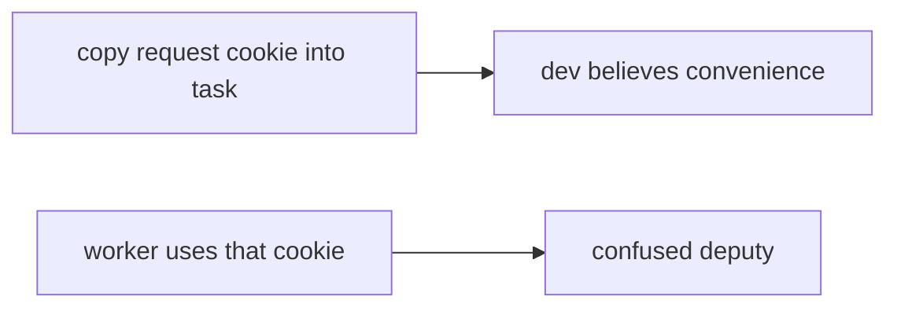

# Same idea on a clinic batch-export worker

**Kind:** transfer-challenge
**Loop step:** 7 Transfer

## Use it somewhere new

You get a **clinic batch-export worker**.

`exporter({"user_session": "alice", "service": None})` must be `None`. A leftover user session is not worker identity. For a clinic, leftover session denied, named worker allowed.

Also name outbox pattern and event schemas as the same identity family, without running those brokers here.

## Picture: cookie in the job is still a session

Overnight patient export is the notes-app worker job.

| Notes app | Clinic sketch |
|---|---|
| `exporter(job)` | Batch-export worker |
| Leftover `user_session` alice denied | Leftover clinician cookie denied |
| `service=worker-sc` allowed | Named clinic worker allowed |
| Stolen cookie stuffed into a job | Stolen clinician session stuffed into a job — **not** a live clinic |

If overnight export copies the clinician cookie into the task while `exporter` prefers `user_session`, the check is gone. A task library, a private network, and a zero-trust dashboard do not bind `service == "worker-sc"`. Outbox pattern and event schemas are the same identity family — name them, do not run those brokers here. A correctly named worker that is still a superuser database role is a 3.3 leftover even when Alice session is denied.

A leftover session still has to be `None`. `service=worker-sc` may still be allowed. Running on the hospital VLAN with “zero trust enabled” without a leftover-session deny test leaves `exporter({user_session: alice})` succeeding. The local check is `test_user_session_is_not_worker_identity` — on a practice, not a live broker attach.

## Write this for a clinic batch-export worker

A small clinic app with “Export overnight” that copies the clinician cookie into the task so “the job knows who asked.”

1. who might try (stolen session stuffed into a job, or inherited request context — not a live clinic);
2. what you trust (worker authenticates as `worker-sc` is what you trust; VLAN, internal queue, and a zero-trust sticker are not);
3. what must not happen (`exporter({user_session: alice})` succeeds);
4. a check on **local** practice files only (leftover session denied — never on the real clinic);
5. leftover (god-mode database role 3.3, retry after revoke 2.4, later originating-subject check as advanced work, field dumps 7.2);
6. whether a human-read “queued as service” must be announced, not a spinner that retries forever.

## What is not good enough

| Reject | Why |
|---|---|
| “Zero trust is enabled” | Guidance, not the check |
| Live clinic / public broker | Course rules |
| “Internal queue is trusted” | Payload is still untrusted |
| VLAN as identity | Network, not principal |
| Job-enqueued HTTP 202 as this check | Wrong observation |

## Practice

Write one page. Leave the answer keys closed. The only running system you may break is `labs/7.4/7.4-lab`. Do not attach to a public broker.

## What this page is not doing

Do not try live-target queues. Do not use real clinician cookies. This page does not finish a check-in.
