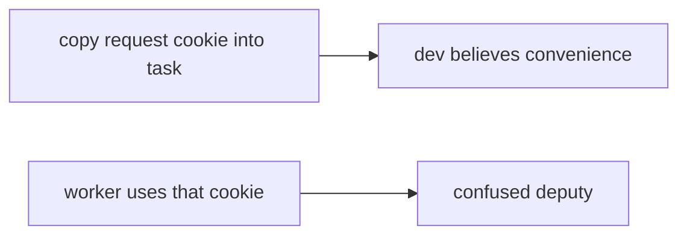

# 7.4-LO-07 — Transfer: clinic batch-export worker

**Kind:** transfer-challenge
**Loop step:** 7 Transfer
**Standards:** OWASP ASVS 5.0.0 (final) `v5.0.0-13.2.1`. NIST SP 800-207 as architecture guidance only. WCAG 2.2 for the enqueue message.

## Change the workplace; keep a worker principal

Do not answer with a Top 10 / CWE / scanner as the definition of security. The SecureCollab sentence was: `exporter({"user_session": "alice", "service": None})` must be `None`. Rewrite it for a clinic without changing the fork.

**Prompt:** Clinic batch-export worker. Also name outbox pattern and event schemas.

**Product sketch:** EHR-lite “Export overnight” that copies the clinician cookie into the Celery task so “the job knows who asked.”

Rewrite the SecureCollab sentence. Include:

1. attacker capabilities (stolen session stuffed into a job, or inherited request context — not a live clinic);
2. trust assumptions (worker authenticates as `worker-sc` is TCB; VLAN/internal queue/zero-trust sticker are not);
3. forbidden outcome (`exporter({user_session: alice})` succeeds, not “HIPAA”);
4. a test idea on a **local** fixture only (no live broker);
5. residual (god-mode DB role 3.3, 2.4 retry after revoke, Level 3 originating subject, 7.2 dumps);
6. WCAG if a human export path is in the claim (readable “queued as service,” not a spinner that retries forever).

## Mental model: cookie in the job is still a session

If overnight export copies the clinician cookie into the task while `exporter` prefers `user_session`, the cell is gone. Celery, a VPC, and a zero-trust dashboard do not bind `service == "worker-sc"`. Outbox pattern and event schemas are the same identity family — name them, do not run those brokers here. A correctly named worker that is still a superuser DB role is a 3.3 residual even when alice session is denied.

The clinic rewrite still has to keep the SecureCollab fork: leftover session `None`, `service=worker-sc` allowed. Running on the hospital VLAN with “zero trust enabled” without a leftover-session deny test leaves `exporter({user_session: alice})` succeeding. The local pytest analogue is `test_user_session_is_not_worker_identity` — on a fixture, not a live broker attach.

## What graders reject

| Reject | Why |
|---|---|
| “Zero trust is enabled” | Guidance, not the oracle |
| Live clinic / public broker | Lab policy |
| “Internal queue is trusted” | Payload is still untrusted |
| VLAN as identity | Network, not principal |
| Job-enqueued HTTP 202 as this cell | Wrong observation |

## Practice

One page. No keys. `labs/7.4/7.4-lab` is the only running system you may break. Do not attach to a public broker.

## Non-goals

Live-target queues. Real clinician cookies. Claiming Gate 7 from this page.
