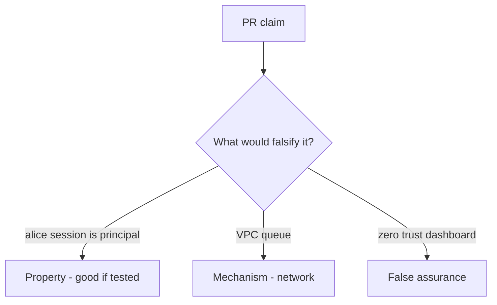

# 7.4-LO-08 — Review inherited request context as a PR, not a zero-trust sticker

**Kind:** code-review
**Loop step:** Review
**Standards:** OWASP ASVS 5.0.0 (final) `v5.0.0-13.2.1`.

## Review the fixture as if it were SecureCollab export worker

Review `labs/7.4/7.4-lab/vulnerable/` as a SecureCollab PR. Intended findings live only in `content/assessment/keys/7.4.md` — not here.

## Mental model: user_session or service fallback / copy request cookies into the job

Start with this seeded smell: **`user_session or service` fallback / copy request cookies into the job**. Label it property, mechanism, or false assurance before you accept the PR.

Seeded smells (label them yourself; do not open the keys file):

- `user_session or service` fallback / copy request cookies into the job
- Worker uses a superuser `DATABASE_URL`
- No test that leftover session is rejected
- Retry duplicates after revoke (2.4)

Also reject: live broker attacks, keys in lessons, real session cookies in fixtures.

## Misconceptions

- Internal queue is trusted input
- Async means no authz
- Service account should be superuser just for jobs

## Practice

Write three review notes. Tie at least one to `test_user_session_is_not_worker_identity`.

## Transfer

Clinic PR that “runs on the hospital VLAN with zero trust” without a leftover-session deny test is incomplete.
