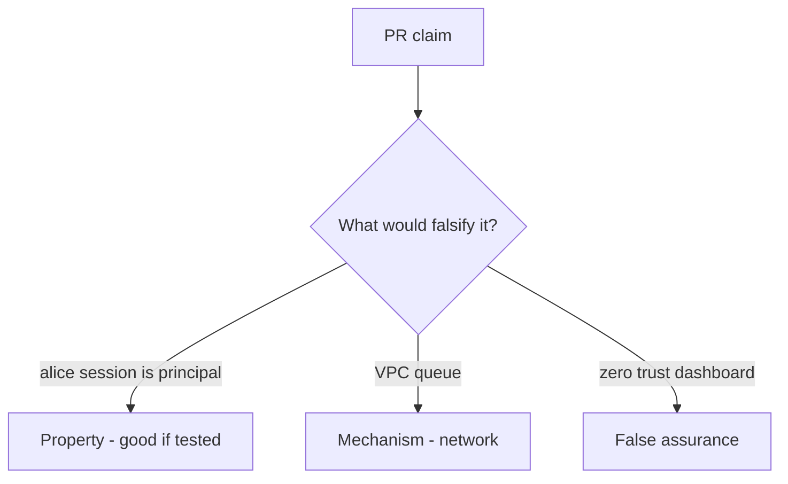

# 7.4-LO-08 — Review inherited request context as a PR, not a zero-trust sticker

**Kind:** code-review
**Loop step:** Review
**Standards:** OWASP ASVS 5.0.0 (final) `v5.0.0-13.2.1`.

## Review the fixture as if it were SecureCollab export worker

Review `labs/7.4/7.4-lab/vulnerable/` as a SecureCollab PR. Your job is not to count suspicious lines. Reconstruct whether `exporter({"user_session": "alice", "service": None})` still returns `"alice"`, compare that with the module invariant, and write changes a developer can verify.

Intended findings live only in `content/assessment/keys/7.4.md` — not here. Do not open the keys file until your review has been evaluated.

## Mental model: user_session or service fallback / copy request cookies into the job

Start with this seeded smell: **`user_session or service` fallback / copy request cookies into the job**. Label it property, mechanism, or false assurance before you accept the PR.

Classification starts at the protected effect (alice session yields `None`). Everything that is not a `service == "worker-sc"` check at that call is a candidate confused-deputy path. A VPC without that pytest is the same smell, not a different finding class.

God-mode `DATABASE_URL` (3.3) and 2.4 retry after revoke are other worker holes — name them, do not skip `test_user_session_is_not_worker_identity`.

## Seeded smells (label them yourself)

- `user_session or service` fallback / copy request cookies into the job
- Worker uses a superuser `DATABASE_URL`
- No test that leftover session is rejected
- Retry duplicates after revoke (2.4)

Also reject: live broker attacks; closing findings without re-running `test_user_session_is_not_worker_identity`; keys in lessons; real session cookies in fixtures.

## Misconceptions this module refuses

- Internal queue is trusted input
- Async means no authz
- Service account should be superuser just for jobs
- Zero trust as a product replaces worker identity tests
- NIST SP 800-207 is the pytest

## Practice

Write three review notes a maintainer could act on. Each note: observation, property or false assurance, suggested structural change, residual you will **not** delete. Tie at least one to `test_user_session_is_not_worker_identity`.

## Transfer

Clinic PR that “runs on the hospital VLAN with zero trust” without a leftover-session deny test is an incomplete identity review. Name the independent falsehood that would still keep alice session `None`.

## Non-goals

Do not merge by adding a comment “will bind service later.” That comment is a residual without an owner. Do not attach to a live broker to prove the finding.
