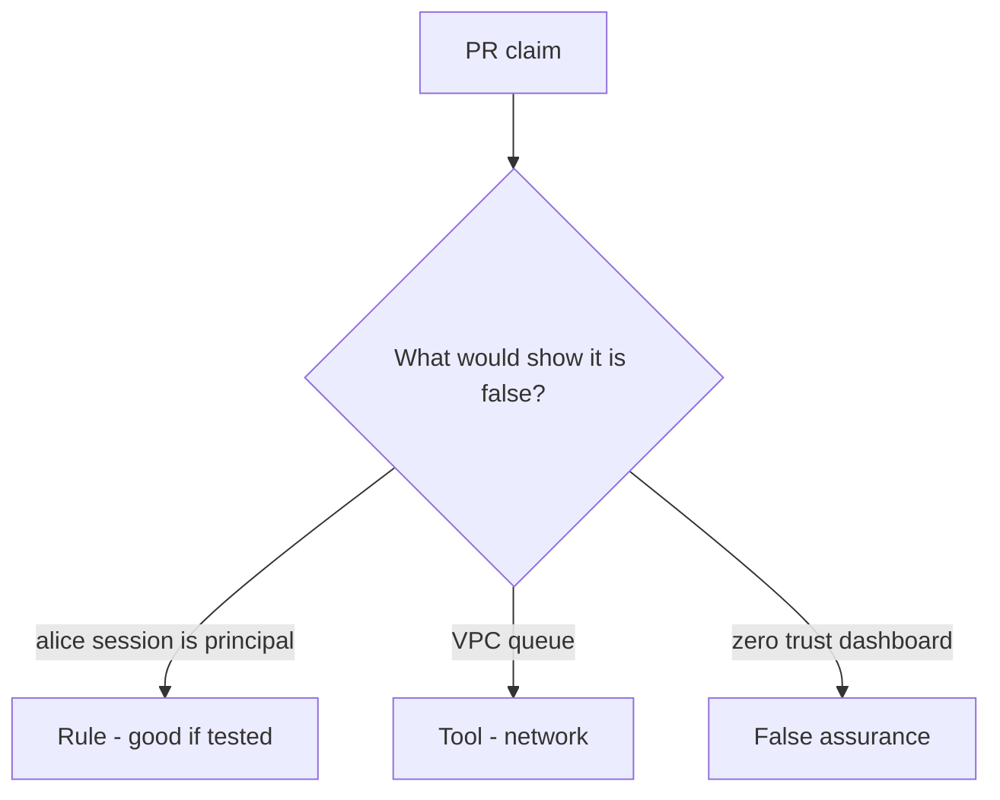

# Would you merge this inherited request context?

**Kind:** code-review
**Loop step:** Review

The answers are not on this page. Do not open the keys file until someone has looked at your review.

## What you are reviewing

A colleague ships notes-app overnight export. Review `labs/7.4/7.4-lab/vulnerable/` as that change. Check whether `exporter({"user_session": "alice", "service": None})` still returns `"alice"`, compare that with the rule, and write changes a developer can verify.

The check you already ran (`test_user_session_is_not_worker_identity`) is the rule test. A comment “will bind service later” is not.

## Picture: user_session or service fallback / copy request cookies into the job

**`user_session or service` fallback / copy request cookies into the job**. Label it rule, tool, or false assurance before you accept the change.

Alice session yields `None`. If that call never includes a `service == "worker-sc"` check, that confused-deputy path is still open. A private network without that check is still the same problem.

A god-mode `DATABASE_URL` (3.3) and retry after revoke (2.4) are other worker holes — name them, do not skip `test_user_session_is_not_worker_identity`.

## Problems to find (name them yourself)

- `user_session or service` fallback / copy request cookies into the job
- Worker uses a superuser `DATABASE_URL`
- No test that leftover session is rejected
- Retry duplicates after revoke (2.4)

Also reject: live broker attacks; closing findings without re-running `test_user_session_is_not_worker_identity`; keys in learner notes; real session cookies in practice files.

## Common mix-ups

- Internal queue is trusted input
- Async means no authz
- Service account should be superuser just for jobs
- Zero trust as a product replaces worker identity tests
- A zero-trust architecture paper is the pytest

## Practice

Write three review notes a maintainer could act on. Each note: what you saw, rule or false assurance, suggested structural change, leftover you will **not** delete. Tie at least one note to `test_user_session_is_not_worker_identity`. Do not open the keys file.

## Use it somewhere new

Clinic change that “runs on the hospital VLAN with zero trust” without a leftover-session deny test is an incomplete review of inherited request context. Name the independent falsehood that would still keep Alice session `None`.

## What this page is not doing

Do not merge by adding a comment “will bind service later.” That comment is leftover without an owner. Do not attach to a live broker to prove the finding.
