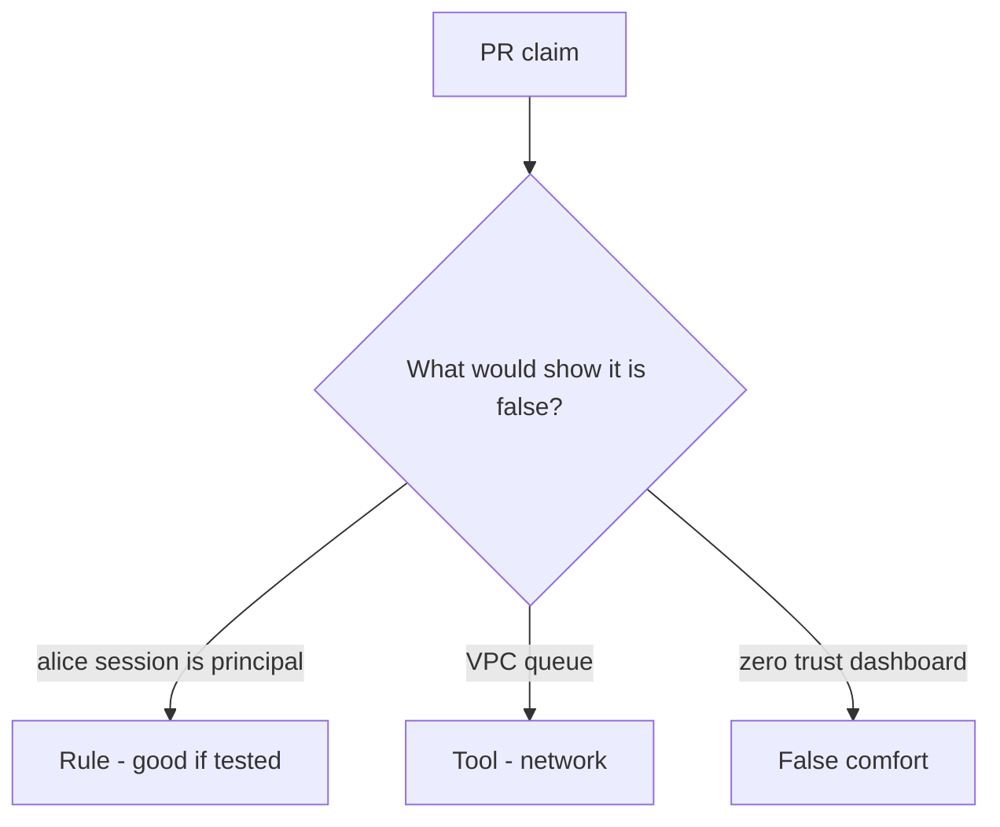

# Review inherited request context like a pull request

**Kind:** code-review
**Loop step:** Review

Intended findings live only in the answer-key folder — not here. Do not open that file until your review has been evaluated.

## What you are reviewing

A colleague ships notes-app overnight export. Review `labs/7.4/7.4-lab/vulnerable/` as that change. Your job is not to count suspicious lines. Reconstruct whether `exporter({"user_session": "alice", "service": None})` still returns `"alice"`, compare that with the rule, and write changes a developer can verify.

The check you already ran (`test_user_session_is_not_worker_identity`) is the rule test. A comment “will bind service later” is not.

## Picture: user_session or service fallback / copy request cookies into the job

Start with this seeded smell: **`user_session or service` fallback / copy request cookies into the job**. Label it rule, tool, or false comfort before you accept the change.

The review starts at the protected effect (Alice session yields `None`). Everything that is not a `service == "worker-sc"` check at that call is a candidate confused-deputy path. A private network without that pytest is the same smell, not a different finding class.

A god-mode `DATABASE_URL` (3.3) and retry after revoke (2.4) are other worker holes — name them, do not skip `test_user_session_is_not_worker_identity`.

## Seeded smells (label them yourself)

- `user_session or service` fallback / copy request cookies into the job
- Worker uses a superuser `DATABASE_URL`
- No test that leftover session is rejected
- Retry duplicates after revoke (2.4)

Also reject: live broker attacks; closing findings without re-running `test_user_session_is_not_worker_identity`; keys in learner notes; real session cookies in fixtures.

## Common mix-ups

- Internal queue is trusted input
- Async means no authz
- Service account should be superuser just for jobs
- Zero trust as a product replaces worker identity tests
- A zero-trust architecture paper is the pytest

## Practice

Write three review notes a maintainer could act on. Each note: what you saw, rule or false comfort, suggested structural change, leftover you will **not** delete. Tie at least one note to `test_user_session_is_not_worker_identity`. Do not open the keys file.

## Use it somewhere new

Clinic change that “runs on the hospital VLAN with zero trust” without a leftover-session deny test is an incomplete review of inherited request context. Name the independent falsehood that would still keep Alice session `None`.

## What this page is not doing

Do not merge by adding a comment “will bind service later.” That comment is leftover without an owner. Do not attach to a live broker to prove the finding.
