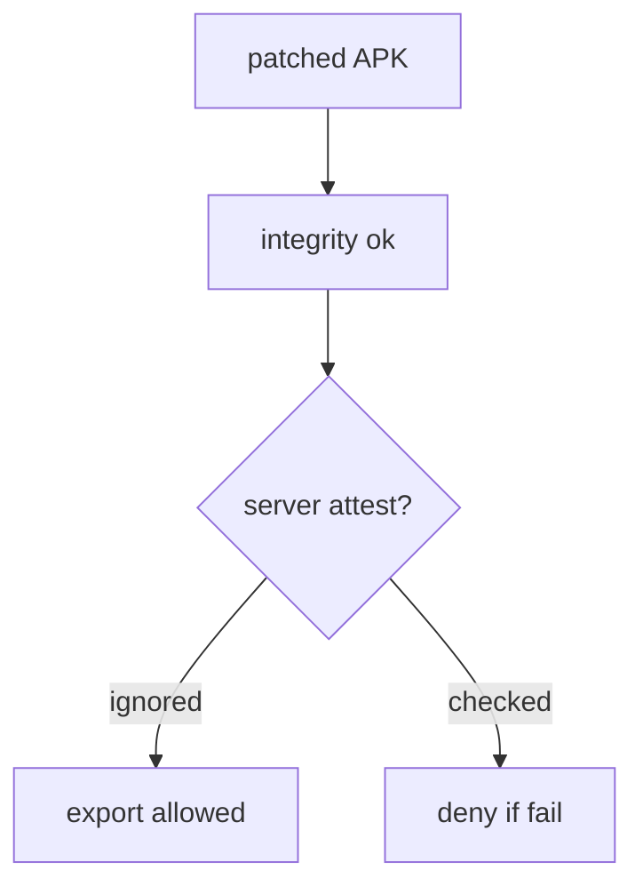
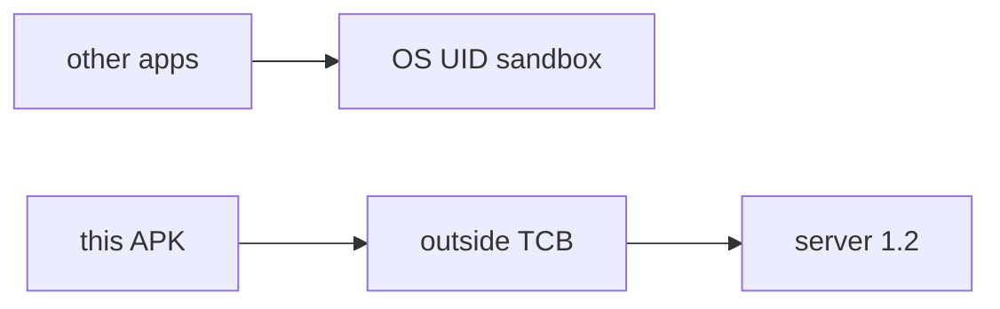

# 8.1-LO-01 — The APK is not in the TCB

**Kind:** concept-model
**Loop step:** 1 Property
**Standards:** OWASP MASVS 2.1.0 (final) `MASVS-PLATFORM`; `MASVS-RESILIENCE-1` is a residual. OWASP ASVS 5.0.0 (final) `v5.0.0-8.2.1`, `v5.0.0-8.3.1`. Mobile Top 10:2024 M7 is *awareness after*. Do not use MASVS L1/L2/R.

## The claim this module owns

SecureCollab now has an Android client. The APK, local files, and every JSON field it sends are **modifiable**. Sandboxing (UID, permissions) raises the cost of *other apps* reading your process; it does not make *this* process honest. Module 1.2 still lives on the **server**.

> `allow_export({"integrity": "ok"}, "fail")` must be false. `allow_export({"integrity": "ok"}, "play_integrity_pass")` may be true.

The forbidden outcome is **client integrity claim authorizes export**. That is authorization evaluated on the attacker’s CPU.

MASVS-PLATFORM is the group for interaction with the OS and other apps. `MASVS-RESILIENCE-1` (platform integrity / attestation) **raises cost**; it does not become 1.2. Play Integrity is a vendor **signal** the server may consult — not a grant.

## Mental model: policy on the attacker CPU



Root, Frida, emulator, and a hex-edited boolean are the same shape: the client chose the answer.

## Mental model: sandbox versus TCB



The store listing and code signing prove *which package id was installed*, not *what that process will send next*.

**Mechanism (not the property):** Play Integrity, R8, SafetyNet brand names, “Kotlin is memory-safe.”

## Root cause vs impact vs prevention vs detection vs recovery

| Slice | For this property |
|---|---|
| Root cause | Policy evaluated on the attacker’s CPU |
| Preconditions | `allow_export({integrity: ok}, fail)` is true |
| Trigger | Modified client or stolen boolean |
| Impact | Export without server authority |
| Prevention | Ignore client integrity for authorization; server attest + session 1.2 |
| Detection | `attest_fail_export_denied` |
| Recovery | Revoke app tokens; require re-attest |

## Framework defaults versus the server guarantee

Android sandbox defaults are not 1.2. Jetpack libraries do not authorize export. FastAPI will accept `integrity=ok` if you bind it.

## Mechanism limits

- Attestation raises cost; emulator farms and replayed tokens remain (8.4).
- Old app versions keep shipping the boolean.
- Honest users on rooted devices need an **owned** product policy, not a silent grant.

## Usability and accessibility

If export is denied, say so in a readable message (WCAG 2.2 4.1.3). Do not trap TalkBack users in a spinner that retries a failing attest.

## Practice

Responsibility matrix: client vs server for each 1.1 cell. Then run:

```
python3 -m pytest labs/8.1/8.1-lab/tests --impl vulnerable
python3 -m pytest labs/8.1/8.1-lab/tests --impl fixed
```

The first command must fail. The second must pass.

## Transfer

Clinic Android `hipaaMode=true`. Feature flags in the APK. `premium=true`.

## Non-goals

Live Play Console, device-farm attacks, Frida cookbooks. Gates 0–10 and milestones M0–M5 stay **not-attempted**. Answer keys are not in this file.
