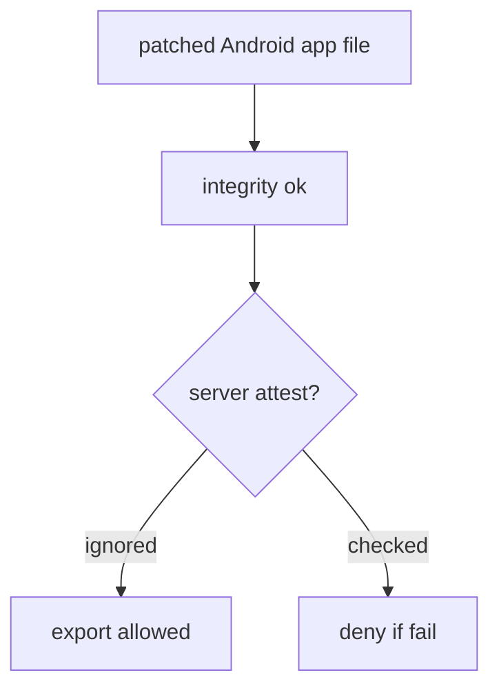
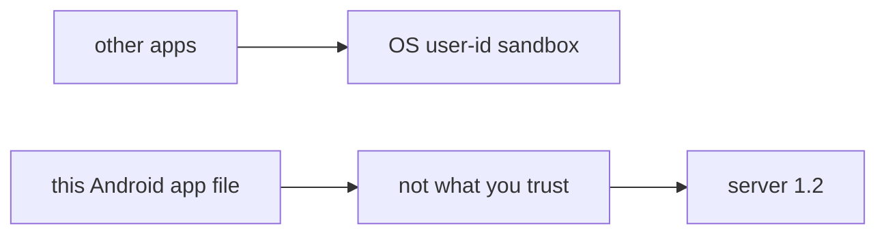

# The Android app file is not what you trust

**Kind:** concept-model
**Loop step:** 1 Property

## The rule

The notes app this week has an Android phone client, written in Kotlin. The Android app file you install (the APK), the files on the phone, and every JSON field the app sends are **modifiable**. The phone's sandbox (a separate user id, permissions) raises the cost of *other apps* reading this process. It does not make *this* process honest. Last topic (1.2) still lives on the **server**.

> `allow_export({"integrity": "ok"}, "fail")` must be false. `allow_export({"integrity": "ok"}, "play_integrity_pass")` may be true.

What must not happen: **a client `integrity=ok` claim authorizes export**. That is authorization decided on the attacker's CPU.

How the app talks to the OS and other apps is a platform topic, not this rule. A platform-integrity check **raises cost**; it does not become 1.2. Play Integrity is a vendor **signal** the server may consult — not a grant. A famous-bugs nickname for “insecure client” is awareness after the cause, not this sentence.

## Picture: policy on the attacker's CPU



A rooted phone, an emulator, and a hex-edited boolean are the same shape: the client chose the answer.

## Picture: sandbox versus what you trust



The store listing and code signing prove *which package id was installed*, not *what that process will send next*.

**A tool is not the rule.** Play Integrity, shrinking the app, SafetyNet brand names, “Kotlin is memory-safe.”

## Why it happens, what it costs, how you stop it, how you notice, how you recover

| Slice | For this rule |
|---|---|
| Why it happens | Policy is decided on the attacker’s CPU |
| What has to be true first | `allow_export({integrity: ok}, fail)` is true |
| Trigger | A modified client or a stolen boolean |
| What it costs | Export without server authority |
| How you stop it | Ignore client integrity for authorization; server attest plus session 1.2 |
| How you notice | `attest_fail_export_denied` |
| How you recover | Revoke app tokens; require a new attest |

## What the framework does vs what you still have to check

Android sandbox defaults are not 1.2. Jetpack libraries do not authorize export. FastAPI will accept `integrity=ok` if you bind it.

What this practice is supposed to show: `allow_export`, client ok plus attest fail is false. The practice folder is `labs/8.1/8.1-lab`. It is local only. It is not a live phone, Play Console, or public app store listing.

## What the tool cannot do

- Attestation raises cost; emulator farms and replayed tokens remain (8.4).
- Old app versions keep shipping the boolean.
- Honest users on rooted phones need an **owned** product policy, not a silent grant.

## Can people still use it

If export is denied, say so in a readable message. Do not trap TalkBack users in a spinner that retries a failing attest.

## Practice

Responsibility matrix: client vs server for each 1.1 rule. Then run:

```text
python3 -m pytest labs/8.1/8.1-lab/tests --impl vulnerable
python3 -m pytest labs/8.1/8.1-lab/tests --impl fixed
```

The first command must fail. The second must pass.

## Use it somewhere new

Clinic Android `hipaaMode=true`. Feature flags in the app file. `premium=true`.

## What this page is not doing

Live Play Console, device-farm attacks, or instrumentation cookbooks against a personal phone. Opening this page does not finish a check-in. Answer keys are not on this site.
