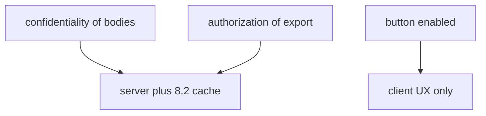
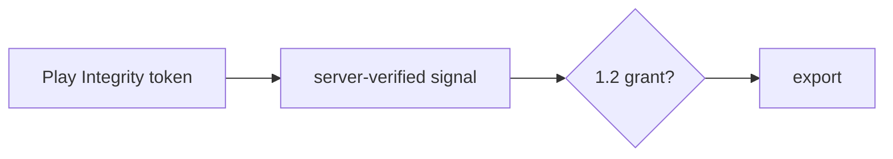

# Client versus server: who decides

**Kind:** design-exercise
**Loop step:** 2 Model

## Could someone else name the checks from your map?

“The phone is sandboxed” is not this lesson. A map someone else can test names **which cell the server still owns**.

This week’s freeze: the notes app’s local `allow_export(client_claims, server_attest)`. Android and Kotlin first. No live phones.

## Picture: every 1.1 rule has an owner

If export is “disabled” in Compose when `integrity != ok`, a patched app file still calls the API.

## Picture: attest is a signal row

A missing or failed attest **denies**. A passed attest still needs the 1.2 grant (4.4 / 6.7 quota).

## Step 1: freeze the pieces

| Piece | This system |
|---|---|
| Who | Patched app file; honest member; emulator |
| What | Export action |
| Actions | `allow_export` |
| Paths | HTTPS JSON from the app |
| What you trust | Server `server_attest` plus session |
| What you do not trust | The app file, the `integrity` field, local UI |
| Time | Token freshness (named leftover) |
| Authorization cell | Authorization of export |

## Step 2: write cells the practice can fail

| Who | What | Action | Decision |
|---|---|---|---|
| client `integrity=ok`, attest fail | export | allow | deny |
| attest `play_integrity_pass` + session | export | allow | may allow |
| Compose hide button | export | UX | not what you trust |
| Platform integrity check | phone | detect | cost, not grant |

## Practice

Draw the matrix. Point at `labs/8.1/8.1-lab` file `client.py`. Label even in the repaired tree: the server attest decides; the client boolean is not what you trust.

## Use it somewhere new

`premium=true` in the app file; clinic `hipaaMode`.

## What can still go wrong

Attestation farms (8.4); rooted honest users; iOS App Attest as a later mirror, same shape.

## What this page is not doing

Do not define security as a famous-bugs list. Answer keys are not on this site.
