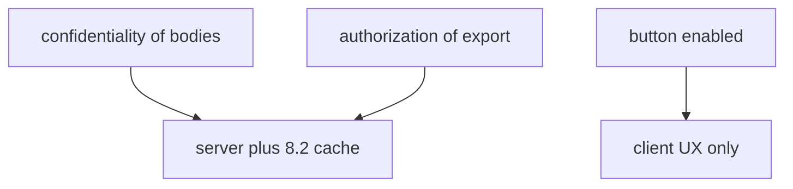
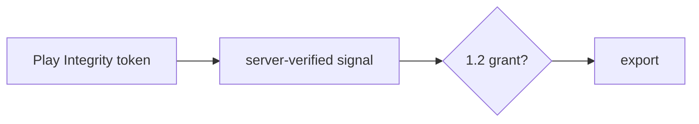

# 8.1-LO-02 — Client versus server responsibility matrix

**Kind:** design-exercise
**Loop step:** 2 Model
**Standards:** OWASP MASVS 2.1.0 (final) `MASVS-PLATFORM`. OWASP ASVS 5.0.0 (final) `v5.0.0-8.3.1`.

## Can a second engineer name pytest cases from your matrix?

“The phone is sandboxed” is not this lesson. A reviewable model names **which cell the server still owns**.

SecureCollab Phase 8 freeze: local `allow_export(client_claims, server_attest)`. Android/Kotlin first. No live devices.

## Mental model: every 1.1 cell has an owner

If export is “disabled” in Compose when `integrity != ok`, a patched APK still calls the API.

## Mental model: attest is a signal row

A missing or failed attest **denies**. A passed attest still needs the 1.2 grant (4.4 / 6.7 quota).

## Step 1: freeze pieces

| Piece | This system |
|---|---|
| Subjects | patched APK; honest member; emulator |
| Objects | export action |
| Actions | `allow_export` |
| Channels | HTTPS JSON from the app |
| TCB | server `server_attest` plus session |
| Untrusted | APK, `integrity` field, local UI |
| State / time | token freshness (named residual) |
| 1.1 cell | authorization of export |

## Step 2: write cells

| Subject | Object | Action | Decision |
|---|---|---|---|
| client `integrity=ok`, attest fail | export | allow | deny |
| attest `play_integrity_pass` + session | export | allow | may allow |
| Compose hide button | export | UX | not TCB |
| MASVS-RESILIENCE-1 | platform | detect | cost, not grant |

## Practice

Draw the matrix. Point at `labs/8.1/8.1-lab` file `client.py`.

## Transfer

`premium=true` in the APK; clinic `hipaaMode`.

## Residual risk

Attestation farms (8.4); rooted honest users; iOS App Attest as a later mirror, same shape.

## Non-goals

Top 10 as the definition of security. Keys stay out of lessons.
