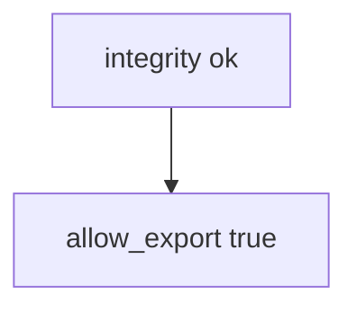

# 8.1-LO-03 — Observe client-claim allow, do not trophy a device farm

**Kind:** mechanism-lab
**Loop step:** 3 Break
**Standards:** OWASP MASVS 2.1.0 (final) `MASVS-PLATFORM`. OWASP ASVS 5.0.0 (final) `v5.0.0-8.3.1`. `MASVS-RESILIENCE-1` is a residual, not this oracle. Mobile Top 10:2024 M7 is awareness after the cause. Do not use MASVS L1/L2/R.

## Authorized scope

`labs/8.1/8.1-lab` only. The fixture is an in-process `allow_export(client_claims, server_attest)`. Synthetic claim dicts (`integrity`, `play_integrity_pass`). No live Play Integrity, Frida, device farms, or public APKs. Do not instrument a personal phone.

**Forbidden outcome:** Client integrity claim authorizes export. `allow_export({"integrity": "ok"}, "fail")` returns true.

Attacker capability in this lab: a modified client or a stolen boolean. That stands in for a hex-edited Compose switch, a clinic `hipaaMode=true` JSON field, or a patched APK that always reports `integrity=ok`. Trust assumption: `allow_export` is supposed to be a **server-side 1.2 cell** that may consult a *server-verified* attestation result. Play Integrity checked only in the app, R8, the store listing, and Android UID sandboxing are not in the TCB for this cell.

## Mental model: the boolean is enough



The vulnerable tree demonstrates **cause** (policy on the client field). Do not run instrumentation against anything except this fixture. Preconditions: `allow_export` returns true when the client says `integrity=ok`, ignoring `server_attest`. You do not need an emulator. You must not call live attestation APIs.

MASVS-PLATFORM is the group for interaction with the OS and other apps. Sandboxing raises the cost of *other apps* reading this process; it does not make *this* process honest. Module 1.2 still lives on the **server**.

## What to read in the fixture

`vulnerable/client.py` returns true when the client says `integrity=ok`, ignoring `server_attest`. Tests:

- `test_client_integrity_claim_is_not_authorization`
- `test_server_attest_may_allow_export`
- `test_missing_client_claim_does_not_authorize` — empty claims plus fail must deny

You do not need a new boolean name. The failure of `test_client_integrity_claim_is_not_authorization` *is* the evidence.

Do not open the fixed tree yet. Diagnose the cause first.

## Root cause vs impact vs prevention vs detection vs recovery

| Slice | This lab |
|---|---|
| Required property | `allow_export({"integrity": "ok"}, "fail")` is false |
| Root cause | Policy evaluated on the attacker’s CPU |
| Preconditions | Client `integrity=ok` is treated as a grant |
| Trigger | Modified client or stolen boolean |
| Impact | Export without server authority |
| Prevention | Ignore client integrity for authorization; server attest + session 1.2 |
| Detection | `attest_fail_export_denied`; never the APK or note body |
| Recovery | Keep deny; revoke app tokens; require re-attest |
| Not the lesson | Mobile Top 10 as the definition; live Play; Frida cookbooks |

## Framework defaults versus the server guarantee

Android sandbox defaults are not 1.2. Jetpack libraries do not authorize export. FastAPI will accept `integrity=ok` if you bind it. Compose `enabled=false` does not bind `allow_export`. The application guarantee is: **this** fixture, client ok plus attest fail is false.

## Practice

```text
python3 -m pytest labs/8.1/8.1-lab/tests --impl vulnerable
```

Run from `labs/8.1/8.1-lab` if a repo-root collection picks up `site/`. Record `test_client_integrity_claim_is_not_authorization`. Do not probe public hosts. An environment error is not security evidence.

## Transfer

Clinic `hipaaMode=true`. Predict without leaving this directory. Do not instrument a live hospital device.

## Non-goals

No live-target or Frida instructions. Synthetic `'play_integrity_pass'` only. Do not dump device-farm cookbooks.
