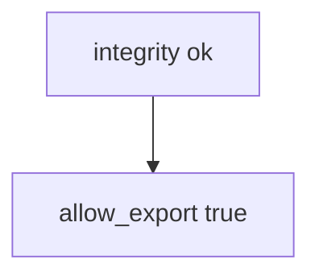

# 8.1-LO-03 — Observe client-claim allow, do not trophy a device farm

**Kind:** mechanism-lab
**Loop step:** 3 Break
**Standards:** OWASP MASVS 2.1.0 (final) `MASVS-PLATFORM`.

## Authorized scope

`labs/8.1/8.1-lab` only. Synthetic claim dicts. No live Play Integrity, Frida, or public APKs.

**Forbidden outcome:** Client integrity claim authorizes export.

## Mental model: the boolean is enough



The vulnerable tree demonstrates **cause** (policy on the client field). Do not run instrumentation against anything except this fixture.

## What to read in the fixture

`vulnerable/client.py` returns true when the client says `integrity=ok`, ignoring `server_attest`. Tests require that pair with `'fail'` to be false.

## Root cause vs impact

| Slice | Lab |
|---|---|
| Root cause | Policy on the attacker’s CPU |
| Impact | Local export grant |
| Not the lesson | Mobile Top 10 as the definition |

## Practice

```
python3 -m pytest labs/8.1/8.1-lab/tests --impl vulnerable
```

Record `test_client_integrity_claim_is_not_authorization`. Do not probe public hosts.

## Transfer

Clinic `hipaaMode=true`. Predict without leaving this directory.

## Non-goals

No live-target or Frida instructions. Synthetic `'play_integrity_pass'` only.
