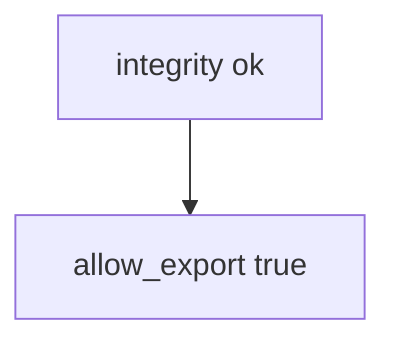

# Practice: client integrity=ok authorizes export

**Kind:** mechanism-lab
**Loop step:** 3 Break

## Try it

The practice is not a phone you attack. `allow_export(client_claims, server_attest)` returns true when the client says `integrity=ok`, so a failing server attest still exports. No device farm is required to see that.

> `allow_export({"integrity": "ok"}, "fail")` must be false. A client integrity claim is not authorization.

## Where you may practice

Stay inside `labs/8.1/8.1-lab`. Fake claim dicts (`integrity`, `play_integrity_pass`) run through `allow_export(client_claims, server_attest)`. It does not open a network. Do not call live Play Integrity. Do not instrument a personal phone, a public app, or an employer clinic device.

Do not paste this exercise onto a live phone, a hospital device, or a public Android package.

`allow_export({"integrity": "ok"}, "fail")` returning true is **client `integrity=ok` authorizing export**.

Picture a modified client or a stolen boolean — a hex-edited Compose switch, a clinic `hipaaMode=true` JSON field, or a patched app file that always reports `integrity=ok`. `allow_export` is supposed to be a **server-side who-is-allowed check** that may consult a *server-verified* attestation result — not Play Integrity checked only in the app, shrinking the app, the store listing, or the Android user-id sandbox.

## Picture: the boolean is enough



Policy sits on the client field. Do not send claims at anything except these local files. `allow_export` returns true when the client says `integrity=ok`, ignoring `server_attest`. You do not need an emulator. You must not call live attestation APIs.

The phone sandbox raises the cost of *other apps* reading this process; it does not make *this* process honest. Last topic (1.2) still lives on the **server**.

## What to read in the broken files

`vulnerable/client.py` returns true when the client says `integrity=ok`, ignoring `server_attest`. Checks:

- `test_client_integrity_claim_is_not_authorization`
- `test_server_attest_may_allow_export`
- `test_missing_client_claim_does_not_authorize` — empty claims plus fail must deny

## Why it happens vs what it costs

| Slice | This practice |
|---|---|
| Required rule | `allow_export({"integrity": "ok"}, "fail")` is false |
| Why it happens | Policy is decided on the attacker’s CPU |
| What's already wrong | Client `integrity=ok` is treated as a grant |
| Trigger | A modified client or a stolen boolean |
| What it costs | Export without server authority |
| How you stop it | Ignore client integrity for authorization; server attest plus session 1.2 |
| How you notice | `attest_fail_export_denied`; never the app file or note body |
| How you recover | Keep deny; revoke app tokens; require a new attest |
| Not the lesson | A bug-list sticker, live Play, or a personal-phone cookbook |

## What the framework does vs what you still have to check

Android sandbox defaults are not 1.2. Jetpack libraries do not authorize export. FastAPI will accept `integrity=ok` if you bind it. Compose `enabled=false` does not bind `allow_export`. Client ok plus attest fail is false.

## Practice

```text
python3 -m pytest labs/8.1/8.1-lab/tests --impl vulnerable
```

Run from `labs/8.1/8.1-lab` if a repo-root collection picks up `site/`. Do not “fix” the check to pass. Do not probe public hosts. A setup error is not proof the rule holds.

## Use it somewhere new

`hipaaMode=true` in the app file is not a server attest. Predict without leaving this directory. Do not instrument a live hospital device.

## What this page is not doing

No live-target or personal-phone steps. Fake `'play_integrity_pass'` only. Do not dump device-farm cookbooks.
