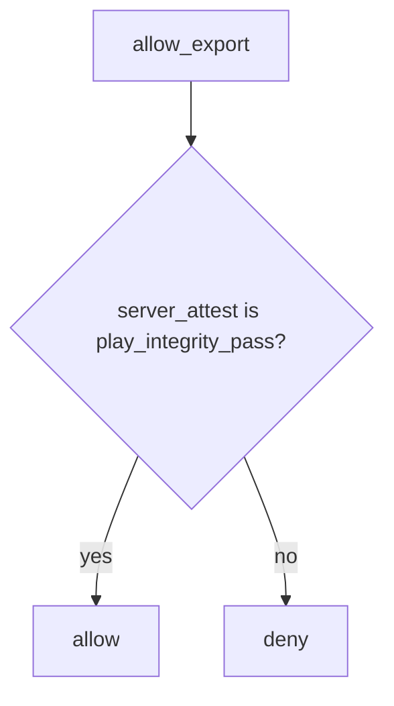

# The server attest decides; ignore the client boolean

**Kind:** design-exercise
**Loop step:** 4 Build

## The rule

A Compose switch that hides the button is not the fix. Play Integrity checked only in the app is not the fix. Shrinking the app is not the fix.

The structural change is: the server **ignores the client integrity field**. `allow_export` must use `server_attest == "play_integrity_pass"` (a local stand-in for a *server-verified* attestation result). The client JSON is not an input to that check. The server attest decides; ignore the client boolean.

The smallest restore for the notes app’s Android export is: client ok plus attest fail denies. Fail-safe: unknown attest **denies**. Do not `or` the client boolean back in. Do not fail open because the attestation service was unreachable.

## Picture: attest on the trusted layer



The repaired files ignore `client_claims` entirely. Production still needs a real server-side token verify (not this check) plus 1.2 session and 4.4 object grants. Play Integrity is a vendor **signal** the server may consult — not a grant. Honest users on rooted phones need an **owned** product policy, not a silent grant (the first page).

Authorization has to be enforced on a trusted service layer. This week's check looks at `allow_export(..., "fail")`.

## What the repaired files must show

| After the fix | Must be true |
|---|---|
| client ok, attest fail | false |
| client ok, attest pass | true |
| empty client, attest fail | false |

Fail closed: if attest is not `play_integrity_pass`, **do not export**. Do not keep `if integrity == ok` because “the store listing looks trusted.”

## What this is not

- Compose `enabled=false`.
- Shrinking the app.
- Play Integrity checked only in the app.
- A platform-integrity check as the grant.
- Store listing as device trust.
- Kotlin memory safety as 1.2.

## What the tool cannot do

- Attestation raises cost; emulator farms and replayed tokens remain (8.4).
- Old app versions keep shipping the boolean.
- Honest users on rooted phones need an owned product policy, not a silent grant.
- 6.7 quota still applies after attest.
- 8.4 debug builds can still point at prod if the channel is unchecked.

## Practice

Name the predicate (`server_attest == "play_integrity_pass"`; client field ignored). Run:

```text
python3 -m pytest labs/8.1/8.1-lab/tests --impl fixed
```

## Use it somewhere new

A clinic example: stop treating a client `hipaaMode` checkbox as the server’s BAA switch.

## What can still go wrong

Token replay; emulator farms; 8.4 debug builds; 6.7 quota; rooted honest clinicians (owned policy).

## What this page is not doing

Do not call live Play Integrity. Do not claim Gate 8 from a SafetyNet screenshot.
