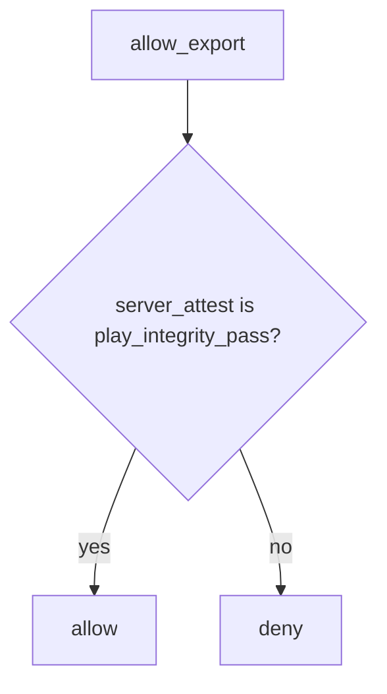

# 8.1-LO-04 — Server attest decides; ignore the client boolean

**Kind:** design-exercise
**Loop step:** 4 Build
**Standards:** OWASP ASVS 5.0.0 (final) `v5.0.0-8.3.1`. MASVS 2.1.0 `MASVS-PLATFORM`.

## Structural means the server ignores the client integrity field

`allow_export` must use `server_attest == "play_integrity_pass"` (lab stand-in for a *server-verified* attestation result). The client JSON is not an input to that predicate.

## Mental model: attest on the trusted layer



Fail-safe: unknown attest **denies**. Do not `or` the client boolean back in.

## Why this restores the cell

| After the fix | Must be true |
|---|---|
| client ok, attest fail | false |
| client ok, attest pass | true |
| empty client, attest fail | false |

## What this is not

Compose `enabled=false`. R8. Play Integrity checked only in the app. MASVS-RESILIENCE-1 as the grant.

## Practice

Name the predicate. Run:

```
python3 -m pytest labs/8.1/8.1-lab/tests --impl fixed
```

Must pass.

## Transfer

Clinic: stop treating a client `hipaaMode` checkbox as the server’s BAA switch.

## Residual risk

Token replay; emulator farms; 8.4 debug builds; 6.7 quota still applies after attest.
