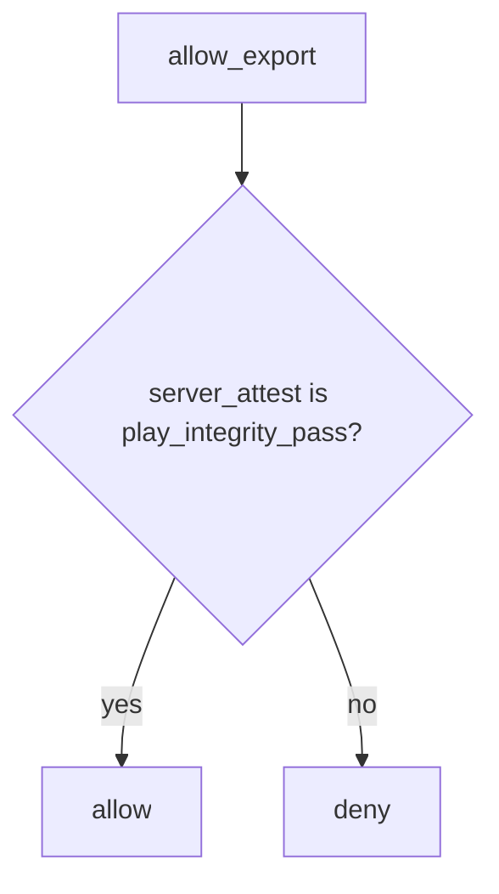

# 8.1-LO-04 — Server attest decides; ignore the client boolean

**Kind:** design-exercise
**Loop step:** 4 Build
**Standards:** OWASP ASVS 5.0.0 (final) `v5.0.0-8.3.1`. MASVS 2.1.0 (final) `MASVS-PLATFORM`. `MASVS-RESILIENCE-1` raises cost; it is not this grant.

## Structural means the server ignores the client integrity field

`allow_export` must use `server_attest == "play_integrity_pass"` (lab stand-in for a *server-verified* attestation result). The client JSON is not an input to that predicate. Structural means that check — not Play Integrity verified only in the app, not R8, not a Compose switch.

The smallest restore for SecureCollab Android export is: client ok plus attest fail denies. Fail-safe: unknown attest **denies**. Do not `or` the client boolean back in. Do not fail open because the attestation service was unreachable.

## Mental model: attest on the trusted layer



The lab’s fixed tree ignores `client_claims` entirely. Production still needs a real server-side token verify (not this pytest) plus 1.2 session and 4.4 object grants. Play Integrity is a vendor **signal** the server may consult — not a grant. Honest users on rooted devices need an **owned** product policy, not a silent grant (LO-01).

ASVS `v5.0.0-8.3.1` wants authorization enforced on a trusted service layer. This pytest is that sentence for `allow_export(..., "fail")`.

## Why this restores the cell

| After the fix | Must be true |
|---|---|
| client ok, attest fail | false |
| client ok, attest pass | true |
| empty client, attest fail | false |

## What this is not

Compose `enabled=false`. R8. Play Integrity checked only in the app. MASVS-RESILIENCE-1 as the grant. Store listing as device trust. Kotlin memory safety as 1.2.

## Mechanism limits

- Attestation raises cost; emulator farms and replayed tokens remain (8.4).
- Old app versions keep shipping the boolean.
- Honest users on rooted devices need an owned product policy, not a silent grant.
- 6.7 quota still applies after attest.
- 8.4 debug builds can still point at prod if the channel is unchecked.

## Practice

Name the predicate (`server_attest == "play_integrity_pass"`; client field ignored). Run:

```text
python3 -m pytest labs/8.1/8.1-lab/tests --impl fixed
```

Must pass. Run from the lab directory if collection at repo root is polluted.

## Transfer

Clinic: stop treating a client `hipaaMode` checkbox as the server’s BAA switch.

## Residual risk

Token replay; emulator farms; 8.4 debug builds; 6.7 quota; rooted honest clinicians (owned policy).

## Non-goals

Do not call live Play Integrity. Do not claim Gate 8 from a SafetyNet screenshot. Do not teach MASVS L1/L2/R as current levels.
