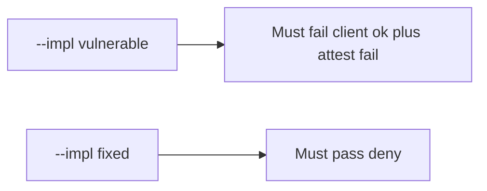

# The broken files must fail when the phone says ok but attest fails

**Kind:** verification-lab
**Loop step:** 5 Verify

## Check it

Naming Play Integrity in a README does not ignore the client boolean. A disabled Compose button is the UI. `allow_export({"integrity": "ok"}, "fail")` has to be false, and `allow_export({"integrity": "ok"}, "play_integrity_pass")` may be true. Vulnerable path: client-ok-plus-attest-fail still returns true. Repair refuses a failing attestation claim. Do not call live attestation APIs.

## Picture: broken files must fail: client ok plus attest fail

Client `integrity=ok` can still authorize export even when tests pass.



If the broken export still passes, the client boolean was never ignored.

## Three things to look at

| Mode | Must show for this topic |
|---|---|
| Wrong input / abuse | client ok, attest fail → false; broken files must fail (`test_client_integrity_claim_is_not_authorization`) |
| Normal | client ok, attest pass → true (`test_server_attest_may_allow_export`; may pass on both) |
| Extra | missing client claim, attest fail → false (`test_missing_client_claim_does_not_authorize`) |
| Not claimed | emulator farms; 4.4 object grant; live Play; platform integrity on a physical phone |

The checks are in `labs/8.1/8.1-lab/tests/test_property.py`. `test_client_integrity_claim_is_not_authorization` is there so a client boolean that authorizes export still fails.

```text
python3 -m pytest labs/8.1/8.1-lab/tests --impl vulnerable
python3 -m pytest labs/8.1/8.1-lab/tests --impl fixed
```

A server that already says yes is the honest path. Deny a failing client integrity claim. If the broken files do not fail `test_client_integrity_claim_is_not_authorization`, the practice is miswired — fix the wiring, not the check.

## What the checks do not prove

- Real Play Integrity token verification
- Platform integrity on a physical phone
- 8.4 debug/release split
- iOS App Attest (later mirror)
- 4.4 object grants after export is allowed
- 6.7 quota

## Practice

Call `allow_export({"integrity": "ok"}, "fail")`. A `PlayIntegrity` line in Gradle is the client library. A setup error is not proof the rule holds.

## Use it somewhere new

A disabled Android button is the UI, not server attest. Do not make a live Play Console call.

## What this page is not doing

A device-farm screenshot is not server attest. Do not log attestation blobs. Answer keys are not on this site.
